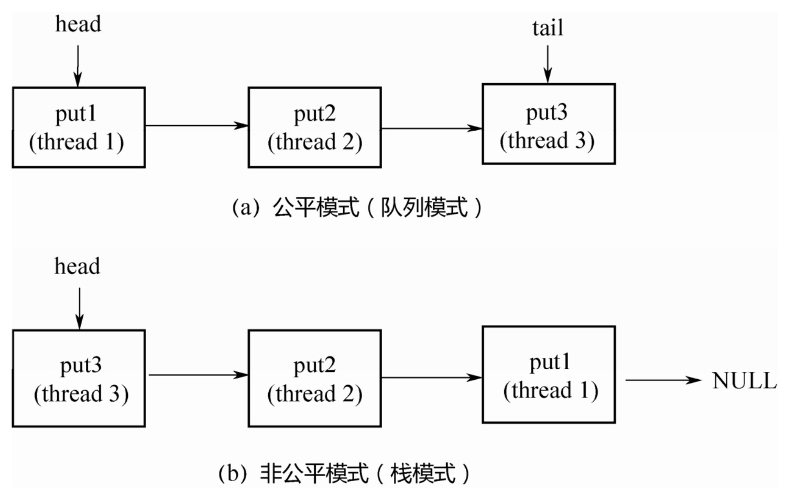

[toc]

## 一. BlockingQueue简介

**BlockingQueue**是一个带**阻塞**功能的队列，当入队列时，若队列已满，则阻塞调用者；当出队列时，若队列为空，则阻塞调用者。

它是current包中的一个接口，有多个实现类，如下图所示(列举常见的5个)：


### 1.1 核心方法

```java
public interface BlockingQueue<E> extends Queue<E> {

    //将给定元素设置到队列中，如果设置成功返回true, 否则抛出异常。如果是往限定了长度的队列中设置值，推荐使用offer()方法。
    boolean add(E e);

    //将给定的元素设置到队列中，如果设置成功返回true, 否则返回false. e的值不能为空，否则抛出空指针异常。
    boolean offer(E e);

    //将元素设置到队列中，如果队列中没有多余的空间，该方法会一直阻塞，直到队列中有多余的空间。
    void put(E e) throws InterruptedException;

    //将给定元素在给定的时间内设置到队列中，如果设置成功返回true, 否则返回false.
    boolean offer(E e, long timeout, TimeUnit unit)
        throws InterruptedException;

    //从队列中获取值，如果队列中没有值，线程会一直阻塞，直到队列中有值，并且该方法取得了该值。
    E take() throws InterruptedException;

    //在给定的时间里，从队列中获取值，时间到了直接调用普通的poll方法，为null则直接返回null。
    E poll(long timeout, TimeUnit unit)
        throws InterruptedException;

    //获取队列中剩余的空间。
    int remainingCapacity();

    //从队列中移除指定的值。
    boolean remove(Object o);

    //判断队列中是否拥有该值。
    public boolean contains(Object o);

    //将队列中值，全部移除，并发设置到给定的集合中。
    int drainTo(Collection<? super E> c);

    //指定最多数量限制将队列中值，全部移除，并发设置到给定的集合中。
    int drainTo(Collection<? super E> c, int maxElements);
}
```

### 1.2 方法总结

|             | *Throws exception* | *Special value* | *Blocks*         | *Times out*          |
| ----------- | ------------------ | --------------- | ---------------- | -------------------- |
| **Insert**  | add(e)             | offer(e)        | **put(e)**       | offer(e, time, unit) |
| **Remove**  | remove()           | poll()          | **take()**       | poll(time, unit)     |
| **Examine** | element()          | peek()          | *not applicable* | *not applicable*     |

> 分析源码时，我们重点关注BlockingQueue的put()、take()两个阻塞方法

## 二. ArrayBlockingQueue

ArrayBlockingQueue 是基于**数组**实现的**有界**阻塞队列(**FIFO**)，在创建ArrayBlockingQueue对象时必须制定容量大小。并且可以指定公平性与非公平性，默认情况下为非公平的，即不保证等待时间最长的线程最优先能够访问队列。

### 2.1 属性

```java
public class ArrayBlockingQueue<E> extends AbstractQueue<E> 
  			implements BlockingQueue<E>, java.io.Serializable { 
  //用于存放元素的数组
  Object[] items; 
  //下一次读取操作的位置
  int takeIndex; 
  //下一次写入操作的位置
  int putIndex; 
  //队列中的元素数量
  int count; 
  // 核心为1个锁外加两个条件 
  final ReentrantLock lock; 
  private final Condition notEmpty; 
  private final Condition notFull; 
  //... 
}
```

### 2.2 构造函数

```java
//指定队列容量，其限制了队列中最多允许的元素个数
public ArrayBlockingQueue(int capacity) { this(capacity, false); }
//指定独占锁是公平锁还是非公平锁。非公平锁的吞吐量比较高，公平锁可以保证每次都是等待最久的线程获取到锁
public ArrayBlockingQueue(int capacity, boolean fair) {
  // ... 
}
//指定用一个集合来初始化，将此集合中的元素在构造方法期间就先添加到队列中
public ArrayBlockingQueue(int capacity, boolean fair, Collection<? extends E> c) { 				    	this(capacity, fair); 
	// ... 
}
```

### 2.3 同步机制

读操作和写操作都需要获取到 AQS 独占锁才能进行操作。如果队列为空，这个时候读操作的线程进入到**读线程队列**排队，等待写线程写入新的元素，然后唤醒读线程队列的第一个等待线程。如果队列已满，这个时候写操作的线程进入到**写线程队列**排队，等待读线程将队列元素移除，然后唤醒写线程队列的第一个等待线程。


### 2.4 源码

#### 2.4.1 put()

在该队列的尾部插入指定的元素，如果队列已满，则等待空间可用

```java
public void put(E e) throws InterruptedException {
    Objects.requireNonNull(e);
    final ReentrantLock lock = this.lock;
  	//可中断的lock
    lock.lockInterruptibly();
    try {
      	//如果队列已满，则阻塞等待notFull满足
        while (count == items.length)
            notFull.await();
      	//入队
        enqueue(e);
    } finally {
        lock.unlock();
    }
}
```

##### 2.4.1.1 enqueue()

在当前放置位置插入元素、推进和信号。只有在保持锁定时才调用

```java
private void enqueue(E e) {
    final Object[] items = this.items;
    items[putIndex] = e;
  	//移动下次写入的位置
    if (++putIndex == items.length) putIndex = 0;
  	//队列元素数量+1
    count++;
  	//通知非空条件
    notEmpty.signal();
}
```

#### 2.4.2 take()

从队列中取出一个元素，如果队列为空，则等待元素可用

```java
public E take() throws InterruptedException {
    final ReentrantLock lock = this.lock;
  	//获取可中断锁
    lock.lockInterruptibly();
    try {
      	//如果队列为空，则阻塞等待notEmpty满足
        while (count == 0)
            notEmpty.await();
      	//出队
        return dequeue();
    } finally {
        lock.unlock();
    }
}
```

##### 2.4.2.1 dequeue()

提取在当前位置的元素，前进，和信号。只有在保持锁定时才调用。

```java
private E dequeue() {
    final Object[] items = this.items;
    @SuppressWarnings("unchecked")
    E e = (E) items[takeIndex];
    items[takeIndex] = null;
  	//移动下次读取的位置
    if (++takeIndex == items.length) takeIndex = 0;
  	//队列元素数量-1
    count--;
    if (itrs != null)
        itrs.elementDequeued();
  	//通知非满条件
    notFull.signal();
    return e;
}
```

## 三. LinkedBlockingQueue

LinkedBlockingQueue是基于**单向链表**的**有界**阻塞队列，在创建LinkedBlockingQueue对象时如果不指定容量大小，则默认大小为Integer.MAX_VALUE，可以当做无界队列也可以当做有界队列来使用。 

### 3.1 属性

```java
public class LinkedBlockingQueue<E> extends AbstractQueue<E>
        implements BlockingQueue<E>, java.io.Serializable {
    // 队列容量
    private final int capacity;
    // 队列中的元素数量
    private final AtomicInteger count = new AtomicInteger(0);
    // 队头
    private transient Node<E> head;
    // 队尾
    private transient Node<E> last;
    // take, poll, peek 等读操作的方法需要获取到这个锁
    private final ReentrantLock takeLock = new ReentrantLock();
    // 如果读操作的时候队列是空的，那么等待 notEmpty 条件
    private final Condition notEmpty = takeLock.newCondition();
    // put, offer 等写操作的方法需要获取到这个锁
    private final ReentrantLock putLock = new ReentrantLock();
    // 如果写操作的时候队列是满的，那么等待 notFull 条件
    private final Condition notFull = putLock.newCondition();
} 
```

### 3.2 构造函数

```java
//无界队列
public LinkedBlockingQueue() {
    this(Integer.MAX_VALUE);
}
//有界队列
public LinkedBlockingQueue(int capacity) {
    if (capacity <= 0) throw new IllegalArgumentException();
    this.capacity = capacity;
  	//注意：这里会初始化一个头节点，count 的计数值不包括这个头节点
    last = head = new Node<E>(null);
}
//用一个集合来初始化，将此集合中的元素在构造方法期间就先添加到队列中
public LinkedBlockingQueue(Collection<? extends E> c) {
        this(Integer.MAX_VALUE);
}  
```

### 3.3 同步机制


### 3.4 源码

#### 3.4.1 put()

```java
public void put(E e) throws InterruptedException {
    if (e == null) throw new NullPointerException();
    //标识是否入队成功，可参考offer()方法
    int c = -1;
    Node<E> node = new Node(e);
    final ReentrantLock putLock = this.putLock;
    final AtomicInteger count = this.count;
    //获取到 putLock 才可以进行插入操作
    putLock.lockInterruptibly();
    try {
        //如果队列满，等待 notFull 的条件满足。
        while (count.get() == capacity) {
            notFull.await();
        }
        // 入队
        enqueue(node);
        // count 原子加 1，c 还是加 1 前的值
        c = count.getAndIncrement();
        // 如果这个元素入队后，队列还没满，调用 notFull.signal() 唤醒其他等待的写线程
        if (c + 1 < capacity)
            notFull.signal();
    } finally {
        // 入队后，释放掉 putLock
        putLock.unlock();
    }
    // 如果 c == 0，说明这个元素入队前队列是空的（不包括head空节点），则需要
    // 唤醒等待 notEmpty 的读线程
    if (c == 0)
        signalNotEmpty();
}
```

##### 3.4.1.1 enqueue()

```java
// 将 last 属性指向这个新元素，并且让原队尾的 next 指向这个元素
private void enqueue(Node<E> node) {
    // assert putLock.isHeldByCurrentThread();
    // assert last.next == null;
    last = last.next = node;
}
```

##### 3.4.1.2 signalNotEmpty()

```java
// 元素入队后，如果需要，调用这个方法唤醒读线程
private void signalNotEmpty() {
    final ReentrantLock takeLock = this.takeLock;
    takeLock.lock();
    try {
        notEmpty.signal();
    } finally {
        takeLock.unlock();
    }
}
```

#### 3.4.2 take()

```java
public E take() throws InterruptedException {
    E x;
    int c = -1;
    final AtomicInteger count = this.count;
    final ReentrantLock takeLock = this.takeLock;
    // 获取 takeLock 进行出队操作
    takeLock.lockInterruptibly();
    try {
        // 如果队列为空，等待 notEmpty 这个条件满足再继续执行
        while (count.get() == 0) {
            notEmpty.await();
        }
        // 出队
        x = dequeue();
        // count 进行原子减 1
        c = count.getAndDecrement();
        // 如果这次出队后，队列不为空，那么调用 notEmpty.signal() 唤醒其他的读线程
        if (c > 1)
            notEmpty.signal();
    } finally {
        // 出队后释放掉 takeLock
        takeLock.unlock();
    }
    // 如果 c == capacity，说明在这个 take 方法发生的时候，队列是满的
    // 出队后队列就不满了，需要唤醒等待 notFull 的写线程
    if (c == capacity)
        signalNotFull();
    return x;
}
```

##### 3.4.2.1 dequeue()

```java
// 出队
private E dequeue() {
    // assert takeLock.isHeldByCurrentThread();
    // assert head.item == null;
    // 之前说了，头结点是空的
    Node<E> h = head;
    Node<E> first = h.next;
    h.next = h; // help GC
    // 设置这个为新的头结点
    head = first;
    E x = first.item;
    first.item = null;
    return x;
}
```

##### 3.4.2.2 signalNotFull()

```java
// 元素出队后，如果需要，调用这个方法唤醒写线程
private void signalNotFull() {
    final ReentrantLock putLock = this.putLock;
    putLock.lock();
    try {
        notFull.signal();
    } finally {
        putLock.unlock();
    }
}
```

**LinkedBlockingQueue和ArrayBlockingQueue的差异：**

- 为了提高并发度，用2把锁，分别控制入队、出队的操作。意味着在put(...)和put(...)之间、

  take()与take()之间是互斥的，put(...)和take()之间并不互斥。但对于count变量，双方都需要

  操作，所以必须是原子类型。

- 因为各自拿了一把锁，所以当需要调用对方的condition的signal时，还必须再加上对方的锁，

  就是signalNotEmpty()和signalNotFull()方法。

- 不仅put会通知 take，take 也会通知 put。当put 发现非满的时候，也会通知其他 put线程；

  当take发现非空的时候，也会通知其他take线程。

## 四. PriorityBlockingQueue

**PriorityBlockingQueue**是基于**数组**的**二叉堆**实现的一个支持线程**优先级排序**的**无界**阻塞队列，默认自然序进行排序，也可以自定义实现compareTo()方法来指定元素排序规则，**不能保证同优先级元素的顺序**。

### 4.1 属性

```java
public class PriorityBlockingQueue<E> extends AbstractQueue<E>
    implements BlockingQueue<E>, java.io.Serializable {
      // 构造方法中，如果不指定大小的话，默认大小为 11
      private static final int DEFAULT_INITIAL_CAPACITY = 11;
      // 数组的最大容量
      private static final int MAX_ARRAY_SIZE = Integer.MAX_VALUE - 8;

      // 存放数据的数组
      private transient Object[] queue;

      // 队列当前大小
      private transient int size;

      // 比较器，如果按照自然序排序，那么此属性可设置为 null
      private transient Comparator<? super E> comparator;

      // 并发控制所用的锁
      private final ReentrantLock lock;

      // 非空条件
      private final Condition notEmpty;

      // 用于分配的自旋锁，通过CAS获得
      private transient volatile int allocationSpinLock;

      // 用于序列化和反序列化的时候用，对于 PriorityBlockingQueue 我们应该比较少使用到序列化
      private PriorityQueue q;
}  
```

### 4.2 构造函数

如果不指定初始大小，内部会设定一个默认值11，当元素个数超过这个大小之后，会自动扩容。

```java
// 默认构造方法，采用默认值(11)来进行初始化
public PriorityBlockingQueue() {
    this(DEFAULT_INITIAL_CAPACITY, null);
}
// 指定数组的初始大小
public PriorityBlockingQueue(int initialCapacity) {
    this(initialCapacity, null);
}
// 指定比较器
public PriorityBlockingQueue(int initialCapacity,
                             Comparator<? super E> comparator) {
    if (initialCapacity < 1)
        throw new IllegalArgumentException();
    this.lock = new ReentrantLock();
    this.notEmpty = lock.newCondition();
    this.comparator = comparator;
    this.queue = new Object[initialCapacity];
}
// 使用集合初始化
public PriorityBlockingQueue(Collection<? extends E> c) {
    this.lock = new ReentrantLock();
    this.notEmpty = lock.newCondition();
    //...
}
```

### 4.3 源码

#### 4.3.1 put(E e)

```java
public void put(E e) {
    // 直接调用 offer 方法，put 方法不会阻塞
    offer(e); 
}
```

##### 4.3.1.1 offer(E e)

```java
public boolean offer(E e) {
    if (e == null)
        throw new NullPointerException();
    final ReentrantLock lock = this.lock;
    // 首先获取到独占锁
    lock.lock();
    int n, cap;
    Object[] array;
    // 如果当前队列中的元素个数 >= 数组的大小，那么需要扩容了
    while ((n = size) >= (cap = (array = queue).length))
        tryGrow(array, cap);
    try {
        Comparator<? super E> cmp = comparator;
        // 节点添加到二叉堆中,并调整二叉堆
        if (cmp == null)
            siftUpComparable(n, e, array);
        else
            siftUpUsingComparator(n, e, array, cmp);
        // 更新 size
        size = n + 1;
        // 唤醒等待的读线程
        notEmpty.signal();
    } finally {
        lock.unlock();
    }
    return true;
}
```

###### 4.3.1.1.1 tryGrow(Object[] array, int oldCap)

```java
private void tryGrow(Object[] array, int oldCap) {
    // 释放offer()中获取到的锁
    lock.unlock(); // must release and then re-acquire main lock
    Object[] newArray = null;
    // 用 CAS 操作将 allocationSpinLock 由 0 变为 1，也算是获取锁
    if (allocationSpinLock == 0 &&
        UNSAFE.compareAndSwapInt(this, allocationSpinLockOffset,0, 1)) {
        try {
            // 如果节点个数小于 64，那么增加的 oldCap + 2 的容量
            // 如果节点数大于等于 64，那么增加 oldCap 的一半
            // 所以节点数较小时，增长得快一些
            int newCap = oldCap + ((oldCap < 64) ?
                                   (oldCap + 2) :
                                   (oldCap >> 1));
            // 这里有可能溢出
            if (newCap - MAX_ARRAY_SIZE > 0) {    // possible overflow
                int minCap = oldCap + 1;
                if (minCap < 0 || minCap > MAX_ARRAY_SIZE)
                    throw new OutOfMemoryError();
                newCap = MAX_ARRAY_SIZE;
            }
            // 如果 queue != array，那么说明有其他线程给 queue 分配了其他的空间
            if (newCap > oldCap && queue == array)
                // 分配一个新的大数组
                newArray = new Object[newCap];
        } finally {
            // 重置，也就是释放锁
            allocationSpinLock = 0;
        }
    }
    // 如果有其他的线程也在做扩容的操作,放弃CPU执行
    if (newArray == null) // back off if another thread is allocating
        Thread.yield();
    // 重新获取锁
    lock.lock();
    // 将原来数组中的元素复制到新分配的大数组中
    if (newArray != null && queue == array) {
        queue = newArray;
        System.arraycopy(array, 0, newArray, 0, oldCap);
    }
}
```

###### 4.3.1.1.2 siftUpComparable(int k, T x, Object[] array)

该方法就是将数据 x 插入到数组 array 的位置 k 处，然后再调整树。

```java
private static <T> void siftUpComparable(int k, T x, Object[] array) {
    Comparable<? super T> key = (Comparable<? super T>) x;
    while (k > 0) {
        // 二叉堆中 a[k] 节点的父节点位置
        int parent = (k - 1) >>> 1;
        Object e = array[parent];
        if (key.compareTo((T) e) >= 0)
            break;
        array[k] = e;
        k = parent;
    }
    array[k] = key;
}
```

#### 4.3.2 take()

```java
public E take() throws InterruptedException {
    final ReentrantLock lock = this.lock;
    // 获取锁
    lock.lockInterruptibly();
    E result;
    try {
        // 出队，队列为空则阻塞等待非空条件满足
        while ( (result = dequeue()) == null)
            notEmpty.await();
    } finally {
        lock.unlock();
    }
    return result;
}
```

##### 4.3.2.1 dequeue()

```java
private E dequeue() {
    int n = size - 1;
    if (n < 0)
        return null;
    else {
        Object[] array = queue;
        // 队头，用于返回
        E result = (E) array[0];
        // 队尾元素先取出
        E x = (E) array[n];
        // 队尾置空
        array[n] = null;
        Comparator<? super E> cmp = comparator;
      	//调整二叉堆
        if (cmp == null)
            siftDownComparable(0, x, array, n);
        else
            siftDownUsingComparator(0, x, array, n, cmp);
        size = n;
        return result;
    }
}
```

###### 4.3.2.1.1 siftDownComparable(int k, T x, Object[] array,  int n)

```java
private static <T> void siftDownComparable(int k, T x, Object[] array, int n) {
    if (n > 0) {
      	//队尾元素
        Comparable<? super T> key = (Comparable<? super T>)x;
        // 这里得到的 half 肯定是非叶节点
        // a[n] 是最后一个元素，其父节点是 a[(n-1)/2]。所以 n >>> 1 代表的节点肯定不是叶子节点
        int half = n >>> 1; 
        while (k < half) {
            // 先取左子节点, k=0,k<<1=0
            int child = (k << 1) + 1; //child=1
          	//左子节点值(c后续用作根节点)
            Object c = array[child];
            int right = child + 1;
            // 如果右子节点存在，而且比左子节点小，将右子节点值赋值给c
            if (right < n &&
                ((Comparable<? super T>) c).compareTo((T) array[right]) > 0)
                c = array[child = right];
            // 如果队尾元素值小于C结束循环
            if (key.compareTo((T) c) <= 0)
                break;
            // 把 C 填充到根节点
            array[k] = c;
            // k 赋值后为 1
            k = child;
        }
        array[k] = key;
    }
}
```

## 五. DelayQueue

**DelayQueue**是基于PriorityQueue实现的延迟队列，是一个无界的阻塞队列，用于放置实现了Delayed接口的对象，其中的对象只能在其到期时才能从队列中取走。因此向队列中插入时永远不会阻塞，获取时才有可能被阻塞

### 5.1 属性

```java
public class DelayQueue<E extends Delayed> extends AbstractQueue<E>
    implements BlockingQueue<E> {
  	//可重入锁
    private final transient ReentrantLock lock = new ReentrantLock();
  	//用于实现阻塞和通知的Condition对象
  	private final Condition available = lock.newCondition();
  	//存储队列元素的队列——优先队列
    private final PriorityQueue<E> q = new PriorityQueue<E>();
  	//用于优化阻塞通知的线程元素leader，Leader/Followers模式
  	private Thread leader = null;
}    
```

> Leader/Followers模式：
>
> 1. 有若干个线程(一般组成线程池)用来处理大量的事件
> 2. 有一个线程作为领导者，等待事件的发生；其他的线程作为追随者，仅仅是睡眠。
> 3. 假如有事件需要处理，领导者会从追随者中指定一个新的领导者，自己去处理事件。
> 4. 唤醒的追随者作为新的领导者等待事件的发生。
> 5. 处理事件的线程处理完毕以后，就会成为追随者的一员，直到被唤醒成为领导者。
>    假如需要处理的事件太多，而线程数量不够(能够动态创建线程处理另当别论)，则有的事件可能会得不到处理。
>
> 所有线程会有三种身份中的一种：leader和follower，以及一个干活中的状态：proccesser。它的基本原则就是，永远最多只有一个leader。而所有follower都在等待成为leader。线程池启动时会自动产生一个Leader负责等待网络IO事件，当有一个事件产生时，Leader线程首先通知一个Follower线程将其提拔为新的Leader，然后自己就去干活了，去处理这个网络事件，处理完毕后加入Follower线程等待队列，等待下次成为Leader。这种方法可以增强CPU高速缓存相似性，及消除动态内存分配和线程间的数据交换。

**Delayed接口:**

- 如果getDelay的返回值小于或等于0，则说明该元素到期，需要从队列中拿出来执行。
- 该接口首先继承了 Comparable 接口，所以要实现该接口，必须实现 Comparable 接口。具

体来说，就是基于getDelay()的返回值比较两个元素的大小。

```java
public interface Delayed extends Comparable<Delayed> {

    /**
     * Returns the remaining delay associated with this object, in the
     * given time unit.
     *
     * @param unit the time unit
     * @return the remaining delay; zero or negative values indicate
     * that the delay has already elapsed
     */
    long getDelay(TimeUnit unit);
}
```

### 5.2 构造函数

```java
public DelayQueue() {}
//集合初始化
public DelayQueue(Collection<? extends E> c) {
    this.addAll(c);
}
```

### 5.3 源码

#### 5.3.1 put(E e)

```java
public void put(E e) {
  	//不阻塞
    offer(e);
}
```

##### 5.3.1.1 offer(E e)

```java
public boolean offer(E e) {
    final ReentrantLock lock = this.lock;
    lock.lock();
    try {
      	//放入二叉堆
        q.offer(e);
      	//如果放入的元素刚好在堆顶(q.peek()取第一个元素)，说明其延迟时间最小，需要通知等待的线程
      	//不在堆顶则不用通知
        if (q.peek() == e) {
            leader = null;
            available.signal();
        }
        return true;
    } finally {
        lock.unlock();
    }
}
```

#### 5.3.2 take()

```java
public E take() throws InterruptedException {
   final ReentrantLock lock = this.lock;
   lock.lockInterruptibly();
   try {
       for (;;) {
           // 如果队列为空，阻塞等待available条件通知
           E first = q.peek();
           if (first == null)
               available.await();
           else {
             	 //如果getDelay的返回值小于或等于0，则说明该元素到期
               long delay = first.getDelay(TimeUnit.NANOSECONDS);
               // 如果延迟时间已到，直接返回第一个元素
               if (delay <= 0)
                   return q.poll();
               // leader线程存在表示有其他线程在等待，那么当前线程肯定需要等待
               else if (leader != null)
                   available.await();
               else {
                   Thread thisThread = Thread.currentThread();
                   leader = thisThread;
                   // 如果没有leader线程，设置当前线程为leader线程
                   // 尝试等待直到延迟时间耗尽（可能提前返回，那么下次
                   // 循环会继续处理）
                   try {
                       available.awaitNanos(delay);
                   } finally {
                       // 如果leader线程还是当前线程，重置它用于下一次循环。
                       // 等待available条件时，锁可能被其他线程占用从而导致
                       // leader线程被改变，所以要检查
                       if (leader == thisThread)
                           leader = null;
                   }
               }
           }
       }
   } finally {
       // 如果没有其他线程在等待，并且队列不为空，通知available条件
       if (leader == null && q.peek() != null)
           available.signal();
       lock.unlock();
   }
}  
```

## 六. SynchronousQueue

**SynchronousQueue**是一个**不存储元素(数据必须从某个写线程交给某个读线程，而不是写到某个队列中等待被消费)**的同步阻塞队列，每一个put操作必须等待take操作，否则不能添加元素。支持公平锁和非公平锁。SynchronousQueue的一个使用场景是在线程池里。Executors.newCachedThreadPool()就使用了SynchronousQueue，这个线程池根据需要（新任务到来时）创建新的线程，如果有空闲线程则会重复使用，线程空闲了60秒后会被回收。

### 6.1 构造方法

```java
//默认非公平策略
public SynchronousQueue(boolean fair) {
    transferer = fair ? new TransferQueue<E>() : new TransferStack<E>();
}
```

SynchronousQueue支持**公平模式**和**非公平模式**，所以底层有两种数据结构:

- 队列（实现公平模式）,有一个头结点和尾结点
- 栈（实现非公平模式）,有一个头结点



**TransferQueue(公平模式)**和**TransferStack(非公平模式)**都继承**Transferer**，实现了抽象方法**transfer(E e, boolean timed, long nanos)**，公平和非公平策略就是对该方法的不同实现。

```java
abstract static class Transferer<E> {
    abstract E transfer(E e, boolean timed, long nanos);
}
```

### 6.2 源码

`put()`/`take()`方法如下所示，它们都调用了transfer()方法，只是传入的参数不同而已。接下来我们从公平和非公平模式分别看下`transfer()`的具体实现。

```java
public void put(E e) throws InterruptedException {
    if (e == null) throw new NullPointerException();
    if (transferer.transfer(e, false, 0) == null) {
        Thread.interrupted();
        throw new InterruptedException();
    }
}

public E take() throws InterruptedException {
    E e = transferer.transfer(null, false, 0);
    if (e != null)
        return e;
    Thread.interrupted();
    throw new InterruptedException();
}
```

#### 6.2.1 非公平模式(默认)

##### 6.2.1.1 TransferStack

```java
static final class TransferStack<E> extends Transferer<E> {
  	static final int REQUEST = 0; 
  	static final int DATA = 1; 
  	static final int FULFILLING = 2;
    static final class SNode {
        //栈顶的下一个节点
        volatile SNode next;        // next node in stack
        //undefined匹配，用来判断阻塞栈元素能被唤醒的时机
        //比如我们先执行 take，此时队列中没有数据，take 被阻塞了，栈元素为 SNode1
        //当 put 时，会把当前 put 的栈元素赋值给 SNode1 的 match 属性，并唤醒 take
        //当 take 被唤醒，发现 SNode1 的 match 属性有值时，就能拿到 put 的数据
        volatile SNode match;       // the node matched to this
        //阻塞的线程
        volatile Thread waiter;     // to control park/unpark
        //未投递/未消费的消息
        Object item;                // data; or null for REQUESTs
        //三种模式
        int mode;
    }
}    
```

##### 6.2.1.2 transfer(E e, boolean timed, long nanos)

```java
@SuppressWarnings("unchecked")
E transfer(E e, boolean timed, long nanos) {
    SNode s = null; // constructed/reused as needed
    
    // e 为空: take 方法，非空: put 方法
    int mode = (e == null) ? REQUEST : DATA;
    
    // 自旋
    for (;;) {
        // 头节点情况分类
        // 1：为空，说明队列中还没有数据
        // 2：非空，并且是 take 类型的，说明头节点线程正等着拿数据
        // 3：非空，并且是 put 类型的，说明头节点线程正等着放数据
        SNode h = head;
        
        // 栈头为空，说明队列中还没有数据。
        // 栈头非空且栈头的类型和本次操作一致
        //	比如都是 put，那么就把本次 put 操作放到该栈头的前面即可，让本次 put 能够先执行
        if (h == null || h.mode == mode) {  // empty or same-mode
            // 设置了超时时间，并且 e 进栈或者出栈要超时了，
            // 就会丢弃本次操作，返回 null 值。
            // 如果栈头此时被取消了，丢弃栈头，取下一个节点继续消费
            if (timed && nanos <= 0) {      // 无法等待
                // 栈头操作被取消
                if (h != null && h.isCancelled())
                    // 丢弃栈头，把栈头的后一个元素作为栈头
                    casHead(h, h.next);     // 将取消的节点弹栈
                // 栈头为空，直接返回 null
                else
                    return null;
            // 没有超时，直接把 e 作为新的栈头
            } else if (casHead(h, s = snode(s, e, h, mode))) {
                // e 等待出栈，一种是空队列 take，一种是 put
                SNode m = awaitFulfill(s, timed, nanos);
                if (m == s) {               // wait was cancelled
                    clean(s);
                    return null;
                }
                // 本来 s 是栈头的，现在 s 不是栈头了，s 后面又来了一个数，把新的数据作为栈头
                if ((h = head) != null && h.next == s)
                    casHead(h, s.next);     // help s's fulfiller
                return (E) ((mode == REQUEST) ? m.item : s.item);
            }
        // 栈头正在等待其他线程 put 或 take
        // 比如栈头正在阻塞，并且是 put 类型，而此次操作正好是 take 类型，走此处
        } else if (!isFulfilling(h.mode)) { // try to fulfill
            // 栈头已经被取消，把下一个元素作为栈头
            if (h.isCancelled())            // already cancelled
                casHead(h, h.next);         // pop and retry
            // snode 方法第三个参数 h 代表栈头，赋值给 s 的 next 属性
            else if (casHead(h, s=snode(s, e, h, FULFILLING|mode))) {
                for (;;) { // loop until matched or waiters disappear
                    // m 就是栈头，通过上面 snode 方法刚刚赋值
                    SNode m = s.next;       // m is s's match
                    if (m == null) {        // all waiters are gone
                        casHead(s, null);   // pop fulfill node
                        s = null;           // use new node next time
                        break;              // restart main loop
                    }
                    SNode mn = m.next;
                     // tryMatch 非常重要的方法，两个作用：
                     // 1 唤醒被阻塞的栈头 m，2 把当前节点 s 赋值给 m 的 match 属性
                     // 这样栈头 m 被唤醒时，就能从 m.match 中得到本次操作 s
                     // 其中 s.item 记录着本次的操作节点，也就是记录本次操作的数据
                    if (m.tryMatch(s)) {
                        casHead(s, mn);     // pop both s and m
                        return (E) ((mode == REQUEST) ? m.item : s.item);
                    } else                  // lost match
                        s.casNext(m, mn);   // help unlink
                }
            }
        } else {                            // help a fulfiller
            SNode m = h.next;               // m is h's match
            if (m == null)                  // waiter is gone
                casHead(h, null);           // pop fulfilling node
            else {
                SNode mn = m.next;
                if (m.tryMatch(h))          // help match
                    casHead(h, mn);         // pop both h and m
                else                        // lost match
                    h.casNext(m, mn);       // help unlink
            }
        }
    }
}
```

**执行流程:**

1. 判断是 put 方法还是 take 方法
2. 判断栈头数据是否为空，如果为空或者栈头的操作和本次操作一致，是的话走 3，否则走 5
3. 判断操作有无设置超时时间，如果设置了超时时间并且已经超时，返回 null，否则走 4
4. 如果栈头为空，把当前操作设置成栈头，或者栈头不为空，但栈头的操作和本次操作相同，也把当前操作设置成栈头，并看看其它线程能否满足自己，不能满足则阻塞自己。比如当前操作是 take，但队列中没有数据，则阻塞自己
5. 如果栈头已经是阻塞住的，需要别人唤醒的，判断当前操作能否唤醒栈头，可以唤醒走 6，否则走 4
6. 把自己当作一个节点，赋值到栈头的 match 属性上，并唤醒栈头节点
7. 栈头被唤醒后，拿到 match 属性，就是把自己唤醒的节点的信息，返回

###### 6.2.1.2.1 awaitFulfill(SNode s, boolean timed, long nanos)

```java
/**
 * 旋转/阻止，直到节点s通过执行操作匹配。
 * @param s 等待的节点
 * @param timed true if timed wait
 * @param nanos 超时时间
 * @return 匹配的节点, 或者是 s 如果被取消
 */
SNode awaitFulfill(SNode s, boolean timed, long nanos) {
	
    // deadline 死亡时间，如果设置了超时时间的话，死亡时间等于当前时间 + 超时时间，否则就是 0
    final long deadline = timed ? System.nanoTime() + nanos : 0L;
    Thread w = Thread.currentThread();
    // 自旋的次数，如果设置了超时时间，会自旋 32 次，否则自旋 512 次。
    // 比如本次操作是 take 操作，自旋次数后，仍无其他线程 put 数据
    // 就会阻塞，有超时时间的，会阻塞固定的时间，否则一致阻塞下去
    int spins = (shouldSpin(s) ?
                 (timed ? maxTimedSpins : maxUntimedSpins) : 0);
    for (;;) {
        // 当前线程有无被打断，如果过了超时时间，当前线程就会被打断
        if (w.isInterrupted())
            s.tryCancel();

        SNode m = s.match;
        if (m != null)
            return m;
        if (timed) {
            nanos = deadline - System.nanoTime();
            // 超时了，取消当前线程的等待操作
            if (nanos <= 0L) {
                s.tryCancel();
                continue;
            }
        }
        // 自选次数减1
        if (spins > 0)
            spins = shouldSpin(s) ? (spins-1) : 0;
        // 把当前线程设置成 waiter，主要是通过线程来完成阻塞和唤醒
        else if (s.waiter == null)
            s.waiter = w; // establish waiter so can park next iter
        else if (!timed)
            // park 阻塞
            LockSupport.park(this);
        else if (nanos > spinForTimeoutThreshold)
            LockSupport.parkNanos(this, nanos);
    }
}
```

当一个 节点/线程 将要阻塞时，它会设置其 waiter 字段，然后在真正 park 之前至少再检查一次状态，从而涵盖了竞争与实现者的关系，并注意到 waiter 非空，因此应将其唤醒。

当由出现在调用点位于堆栈顶部的节点调用时，对停放的调用之前会进行旋转，以避免在生产者和消费者及时到达时阻塞。 这可能只足以在多处理器上发生。

从主循环返回的检查顺序反映了这样一个事实，即优先级: 中断 > 正常的返回 > 超时。 （因此，在超时时，在放弃之前要进行最后一次匹配检查。）除了来自非定时SynchronousQueue的调用。{poll / offer}不会检查中断，根本不等待，因此陷入了转移方法中 而不是调用awaitFulfill。

而且可以发现其阻塞策略，并不是一上来就阻塞住，而是在自旋一定次数后，仍然没有其它线程来满足自己的要求时，才会真正的阻塞。

#### 6.2.2 公平模式

##### 6.2.2.1 TransferQueue

```java
static final class TransferQueue<E> extends Transferer<E> {
  static final class QNode {
    	//当前元素的下一个元素
      volatile QNode next;          // next node in queue
    	//当前元素的值，如果当前元素被阻塞住了，等其他线程来唤醒自己时，其他线程会把自己 set 到 item 里面
      volatile Object item;         // CAS'ed to or from null
    	//阻塞线程
      volatile Thread waiter;       // to control park/unpark
    	//true 是 put，false 是 take
      final boolean isData;
  }  
}  
```

##### 6.2.2.2 transfer(E e, boolean timed, long nanos)

```java
E transfer(E e, boolean timed, long nanos) {
    /**
     *
     * 这个基本方法, 主要分为两种情况
     *
     * 1. 若队列为空 / 队列中的尾节点和自己的 类型相同, 则添加 node
     *      到队列中, 直到 timeout/interrupt/其他线程和这个线程匹配
     *      timeout/interrupt awaitFulfill方法返回的是 node 本身
     *      匹配成功的话, 要么返回 null (producer返回的), 或正真的传递值 (consumer 返回的)
     *
     * 2. 队列不为空, 且队列的 head.next 节点是当前节点匹配的节点,
     *      进行数据的传递匹配, 并且通过 advanceHead 方法帮助 先前 block 的节点 dequeue
     */

    QNode s = null; // 根据需要构造/重用
    // true:put  false:get
    boolean isData = (e != null);

    for (;;) {
        // 队列首尾的临时变量,队列空时，t=h
        QNode t = tail;
        QNode h = head;
        if (t == null || h == null) // 看到未初始化的值
            continue;               // 自旋
        // 首尾节点相同，队列空
        // 或队尾节点的操作和当前节点操作相同
        if (h == t || t.isData == isData) {
            QNode tn = t.next;
            // tail 被修改,重试
            if (t != tail)
                continue;
            // 队尾后面的值还不为空，说明其他线程添加了 tail.next,t 还不是队尾，直接把 tn 赋值给 t
            if (tn != null) {
                advanceTail(t, tn);
                // 自旋
                continue;
            }
            // 超时直接返回 null
            if (timed && nanos <= 0)        // 等不及了
                return null;
            // 创建节点
            if (s == null)
                s = new QNode(e, isData);
            // 如果把 s 放到队尾失败，继续递归放进去
            if (!t.casNext(null, s))        // 链接失败
                continue;

            advanceTail(t, s);              // 推进 tail 节点并等待
            // 阻塞住自己,直到有其他线程与之匹配, 或它自己进行线程的中断
            Object x = awaitFulfill(s, e, timed, nanos);
            if (x == s) {                   // wait was cancelled
                clean(t, s); //  对接点 s 进行清除, 若 s 不是链表的最后一个节点, 则直接 CAS 进行 节点的删除, 若 s 是链表的最后一个节点, 则 要么清除以前的 cleamMe 节点(cleamMe != null), 然后将 s.prev 设置为 cleanMe 节点, 下次进行删除 或直接将 s.prev 设置为cleanMe
                return null;
            }

            if (!s.isOffList()) {           // 尚未取消链接
                advanceHead(t, s);          // unlink if head 推进head 节点, 下次就调用 s.next 节点进行匹配(这里调用的是 advanceHead, 因为代码能执行到这边说明s已经是 head.next 节点了)
                if (x != null)              // and forget fields
                    s.item = s;
                s.waiter = null;
            }
            return (x != null) ? (E)x : e;
        // 队列不为空，并且当前操作和队尾不一致
        // 也就是说当前操作是队尾是对应的操作
        // 比如说队尾是因为 take 被阻塞的，那么当前操作必然是 put
        } el***plementary-mode
            // 如果是第一次执行，此处的 m 代表就是 tail
            // 也就是这行代码体现出队列的公平，每次操作时，从头开始按照顺序进行操作
            QNode m = h.next;               // node to fulfill
            if (t != tail || m == null || h != head)
                continue;                   // inconsistent read

            Object x = m.item;
            if (isData == (x != null) ||    // m already fulfilled
                x == m ||                   // m cancelled
                // m 代表栈头
                // 这里把当前的操作值赋值给阻塞住的 m 的 item 属性
                // 这样 m 被释放时，就可得到此次操作的值
                !m.casItem(x, e)) {         // lost CAS
                advanceHead(h, m);          // dequeue and retry
                continue;
            }
            // 当前操作放到队头
            advanceHead(h, m);              // successfully fulfilled
            // 释放队头阻塞节点
            LockSupport.unpark(m.waiter);
            return (x != null) ? (E)x : e;
        }
    }
}
```

线程被阻塞住后，当前线程是如何把自己的数据传给阻塞线程的。

假设线程 1 从队列中 take 数据 ，被阻塞，变成阻塞线程 A 然后线程 2 开始往队列中 put 数据 B，大致的流程如下：

- 线程 1 从队列 take 数据，发现队列内无数据，于是被阻塞，成为 A
- 线程 2 往队尾 put 数据，会从队尾往前找到第一个被阻塞的节点，假设此时能找到的就是节点 A，然后线程 B 把将 put 的数据放到节点 A 的 item 属性里面，并唤醒线程 1
- 线程 1 被唤醒后，就能从 A.item 里面拿到线程 2 put 的数据了，线程 1 成功返回。

在这个过程中，公平主要体现在，每次 put 数据的时候，都 put 到队尾上，而每次拿数据时，并不是直接从堆头拿数据，而是从队尾往前寻找第一个被阻塞的线程，这样就会按照顺序释放被阻塞的线程。

###### 6.2.2.2.1 advanceTail(QNode t, QNode nt)

CAS尝试将nt作为新的tail节点

```java
void advanceTail(QNode t, QNode nt) {
    if (tail == t)
        UNSAFE.compareAndSwapObject(this, tailOffset, t, nt);
}
```

**总结：**

ArrayBlockingQueue 底层是数组，有界队列，如果我们要使用生产者-消费者模式，这是非常好的选择。

LinkedBlockingQueue 底层是链表，可以当做无界和有界队列来使用，所以大家不要以为它就是无界队列。

SynchronousQueue 本身不带有空间来存储任何元素，使用上可以选择公平模式和非公平模式。

PriorityBlockingQueue 是无界队列，基于数组，数据结构为二叉堆，数组第一个也是树的根节点总是最小值。