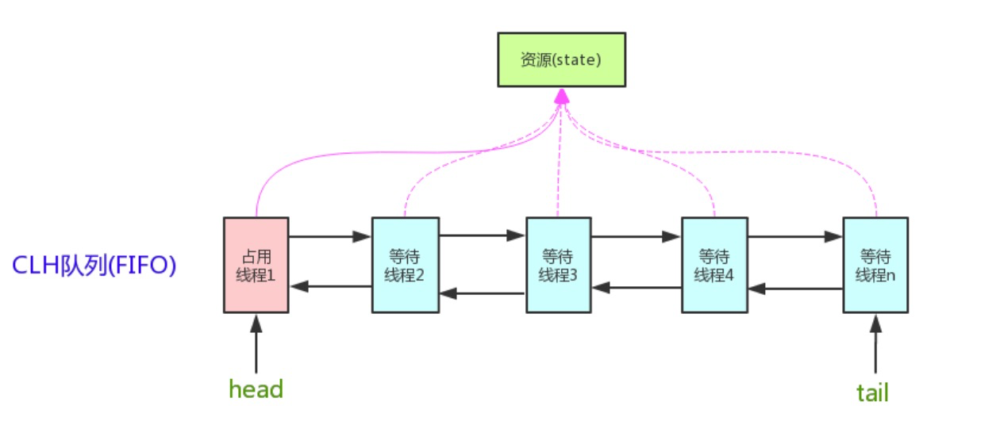
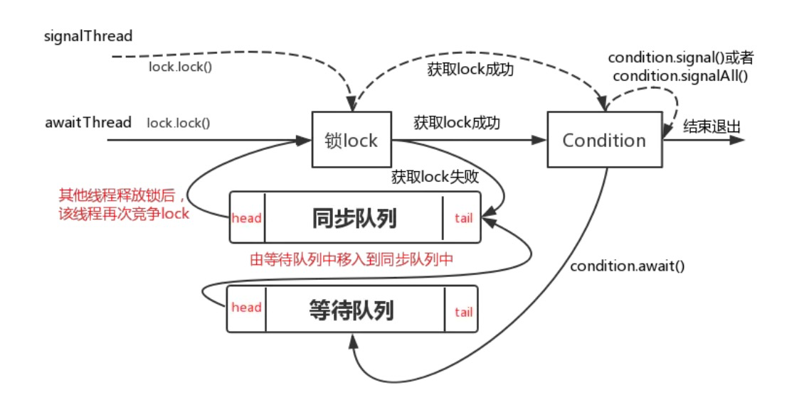

[toc]

## 一. 概述

AQS 的全称为（**`AbstractQueuedSynchronizer`**），这个类在 java.util.concurrent.locks 包下面。

AQS 是一个用来构建锁和同步器的框架，使用 AQS 能简单且高效地构造出应用广泛的大量的同步器，比如 ReentrantLock、Semaphore、ReentrantReadWriteLock、SynchronousQueue、FutureTask 等皆是基于 AQS 的。当然，我们自己也能利用 AQS 非常轻松容易地构造出符合我们自己需求的同步器。

## 二. 原理

AQS 核心思想是：**如果被请求的共享资源空闲，则将当前请求资源的线程设置为有效的工作线程，并且将共享资源设置为锁定状态。如果被请求的共享资源被占用，那么就需要一套线程阻塞等待以及被唤醒时锁分配的机制，这个机制 AQS 是用 CLH 队列锁实现的，即将暂时获取不到锁的线程加入到队列中**。

> CLH(Craig,Landin,and Hagersten)队列是一个虚拟的双向队列（虚拟的双向队列即不存在队列实例，仅存在结点之间的关联关系）。AQS 是将每条请求共享资源的线程封装成一个 CLH 锁队列的一个结点（Node）来实现锁的分配。

AQS原理图：



AQS中几个重要的成员变量：

```java
// CLH队列的头节点
private transient volatile Node head;
// CLH队列的尾节点
private transient volatile Node tail;
// 同步状态
private volatile int state;
```

### 2.1 同步状态变量state

AQS 使用一个 int 成员变量来表示**同步状态**，通过内置的 FIFO 队列来完成获取资源线程的排队工作。AQS 使用 CAS 对该同步状态进行原子操作实现对其值的修改。

```java
private volatile int state;//共享变量，使用volatile修饰保证线程可见性
```

state状态信息通过 protected 类型的**`getState`**，**`setState`**，**`compareAndSetState`**进行操作

```java
//返回同步状态的当前值
protected final int getState() {
        return state;
}
 // 设置同步状态的值
protected final void setState(int newState) {
        state = newState;
}
//原子地（CAS操作）将同步状态值设置为给定值update如果当前同步状态的值等于expect（期望值）
protected final boolean compareAndSetState(int expect, int update) {
        return unsafe.compareAndSwapInt(this, stateOffset, expect, update);
}
```

### 2.2 AQS共享方式

- **Exclusive（独占，只有一个线程能执行，如ReentrantLock）**
- **Share（共享，多个线程可同时执行，如Semaphore/CountDownLatch）**

这样方便使用者实现不同类型的同步组件，独占式如ReentrantLock，共享式如Semaphore，CountDownLatch，组合式的如ReentrantReadWriteLock。总之，AQS为使用提供了底层支撑，如何组装实现，使用者可以自由发挥。

### 2.3 同步器的实现

同步器的设计是基于**模板方法模式**的，它是模板方法模式很经典的一个应用，一般的使用方式是这样：

1. **使用者继承 AbstractQueuedSynchronizer 并重写指定的方法。（这些重写方法很简单，无非是对于共享资源 state 的获取和释放）**
2. **将 AQS 组合在自定义同步组件的实现中，并调用其模板方法，而这些模板方法会调用使用者重写的方法。**

不同的自定义同步器争用共享资源的方式也不同。**自定义同步器在实现时只需要实现共享资源state的获取与释放方式即可**，至于具体线程等待队列的维护（如获取资源失败入队/唤醒出队等），AQS已经在顶层实现好了。

自定义同步器实主要实现以下几种方法：

- **protected boolean isHeldExclusively()：**该线程是否正在独占资源。只有用到condition才需要去实现它。
- **protected booleantryAcquire(int)：**独占方式。尝试获取资源，成功则返回true，失败则返回false。
- **protected boolean tryRelease(int)：**独占方式。尝试释放资源，成功则返回true，失败则返回false。
- **protected int tryAcquireShared(int)：**共享方式。尝试获取资源。负数表示失败；0表示成功，但没有剩余可用资源；正数表示成功，且有剩余资源。
- **protected boolean tryReleaseShared(int)：**共享方式。尝试释放资源，如果释放后允许唤醒后续等待节点返回true，否则返回false。

以ReentrantLock为例，state初始化为0，表示未锁定状态。A线程lock()时，会调用tryAcquire()独占该锁并将state+1。此后，其他线程再tryAcquire()时就会失败，直到A线程unlock()到state=0（即释放锁）为止，其它线程才有机会获取该锁。当然，释放锁之前，A线程自己是可以重复获取此锁的（state会累加），这就是可重入的概念。但要注意，获取多少次就要释放多么次，这样才能保证state是能回到零态的。

再以CountDownLatch以例，任务分为N个子线程去执行，state也初始化为N（注意N要与线程个数一致）。这N个子线程是并行执行的，每个子线程执行完后countDown()一次，state会CAS减1。等到所有子线程都执行完后(即state=0)，会unpark()主调用线程，然后主调用线程就会从await()函数返回，继续后余动作。

一般来说，自定义同步器要么是独占方法，要么是共享方式，他们也只需实现tryAcquire-tryRelease、tryAcquireShared-tryReleaseShared中的一种即可。但AQS也支持自定义同步器同时实现独占和共享两种方式，如ReentrantReadWriteLock。

## 三. 源码详解

### 3.1 结点状态waitStatus

先说说Node吧，它是AQS的一个内部类，Node节点是对每一个等待获取资源的线程的封装，其包含了需要同步的线程本身及其等待状态，如是否被阻塞、是否等待唤醒、是否已经被取消等。变量waitStatus则表示当前Node结点的等待状态，共有5种取值CANCELLED、SIGNAL、CONDITION、PROPAGATE、0。

- **CANCELLED(1)：**表示当前节点已取消调度。当timeout或被中断（响应中断的情况下），会触发变更为此状态，进入该状态后的结点将不会再变化。
- **SIGNAL(-1)：**表示后继节点在等待当前结点唤醒。**后继结点入队时，会将前驱节点的状态更新为SIGNAL。**
- **CONDITION(-2)：**表示节点等待在Condition上，当其他线程调用了Condition的signal()/singnalAll()方法后，CONDITION状态的结点将**从等待队列转移到同步队列中**，等待获取同步锁。
- **PROPAGATE(-3)：**共享模式下，前继结点不仅会唤醒其后继结点，同时也可能会唤醒后继的后继结点。
- **0：**新结点入队时的默认状态。

注意，**负值表示结点处于有效等待状态，而正值表示结点已被取消。所以源码中很多地方用>0、<0来判断结点的状态是否正常**。

Node中其他成员变量：

```java
// 当前节点的前驱节点
volatile Node prev;
// 当前节点的后继节点
volatile Node next;
// 当前线程
volatile Thread thread;
// 下一个等待节点(conditon等待队列的会用到)
Node nextWaiter;
```

### 3.2 acquire(int)

该方法是独占模式下线程获取共享资源的顶层入口。如果获取到资源，线程直接返回，否则进入等待队列，直到获取到资源为止，且整个过程忽略中断的影响。获取到资源后，线程就可以去执行其临界区代码了。代码如下：

```java
public final void acquire(int arg) {
    if (!tryAcquire(arg) &&
        acquireQueued(addWaiter(Node.EXCLUSIVE), arg))
        selfInterrupt();
}
```

1. tryAcquire()尝试直接去获取资源，如果成功则直接返回
2. addWaiter()将该线程加入等待队列的尾部，并标记为独占模式
3. acquireQueued()使线程阻塞在等待队列中获取资源，一直获取到资源后才返回。如果在整个等待过程中被中断过，则返回true，否则返回false
4. 如果线程在等待过程中被中断过，它是不响应的。只是获取资源后才再进行自我中断selfInterrupt()，将中断补上

#### 3.2.1 tryAcquire(int)

此方法尝试去获取独占资源。如果获取成功，则直接返回true，否则直接返回false。这也正是tryLock()的语义，当然不仅仅只限于tryLock()。代码如下：

```java
protected boolean tryAcquire(int arg) {
        throw new UnsupportedOperationException();
}
```

AQS这里只定义了一个接口，具体资源的获取交由自定义同步器去实现。

#### 3.2.2 addWaiter(Node)

如果子类的tryAcquire(int)返回false，则调用此方法将当前线程加入到等待队列的队尾，并返回当前线程所在的结点。代码如下：

```java
private Node addWaiter(Node mode) {
		// 创建一个独占类型的节点
    Node node = new Node(Thread.currentThread(), mode);
    // Try the fast path of enq; backup to full enq on failure
    Node pred = tail;
    // 如果 tail 节点不是 null，就将新节点的 pred 节点设置为 tail 节点。
    // 并且将新节点设置成 tail 节点。
    if (pred != null) {
        node.prev = pred;
        if (compareAndSetTail(pred, node)) {
            pred.next = node;
            return node;
        }
    }
    // 如果 tail 节点是  null，或者 CAS 设置 tail 失败。
    // 在 enq 方法中处理
    enq(node);
    return node;
}
```

##### 3.2.2.1 enq(Node)

此方法用于将node加入队尾。代码如下：

```java
private Node enq(final Node node) {
  	// CAS"自旋"，直到成功加入队尾
    for (;;) {
        Node t = tail;
        // 如果 tail 是 null，就创建一个虚拟节点，同时指向 head 和 tail，称为 初始化。
        if (t == null) { // Must initialize
            if (compareAndSetHead(new Node()))
                tail = head;
        // 如果不是 null
        } else {
        	// 和上个方法逻辑一样，将新节点追加到 tail 节点后面，并更新队列的 tail 为新节点。
        	// 只不过这里是死循环的，失败了还可以再来 。
            node.prev = t;
            if (compareAndSetTail(t, node)) {
                t.next = node;
                return t;
            }
        }
    }
}
```

#### 3.2.3 acquireQueued(Node, int)

通过tryAcquire()和addWaiter()，该线程获取资源失败，已经被放入等待队列尾部了。接下来线程将**进入等待状态休息，直到其他线程彻底释放资源后唤醒自己，自己再拿到资源，然后就可以去干自己想干的事了**。代码如下：

```java
final boolean acquireQueued(final Node node, int arg) {
  	//标记是否成功获取到资源
    boolean failed = true;
    try {
      	//标记等待过程中是否被中断过
        boolean interrupted = false;

        //又是一个“自旋”！
        for (;;) {
          	// 获取前驱节点
            final Node p = node.predecessor();
            // 如果前驱是head，即该结点为队列中第二个节点，就尝试获取资源
            if (p == head && tryAcquire(arg)) {
              	// 如果获取成功，就将当前节点设置为head，同时node.prev置为null
                setHead(node);
              	// 再将head.next置为null，就是为了方便GC回收以前的head结点。也就意味着之前获取到锁的节点出队了
                p.next = null; // help GC
              	// 成功获取资源
                failed = false; 
              	//返回等待过程中是否被中断过
                return interrupted;
            }

            // 获取资源失败后，就阻塞当前节点，等待唤醒
            // shouldParkAfterFailedAcquire检查上一个节点的状态，如果是 SIGNAL 就阻塞，否则就改成 SIGNAL
            if (shouldParkAfterFailedAcquire(p, node) &&
                // 成功设置前驱节点的waitStatus为SIGNAL后(可以休息了)，就阻塞当前节点
                parkAndCheckInterrupt())
              	//如果等待过程中被中断过，哪怕只有那么一次，就将interrupted标记为true
                interrupted = true;
        }
    } finally {
      	// 如果等待过程中没有成功获取资源（如timeout，或者可中断的情况下被中断了），那么取消结点在队列中的等待
        if (failed) 
            cancelAcquire(node);
    }
}
```

##### 3.2.3.1 shouldParkAfterFailedAcquire(Node, Node)

检查前驱节点的waitStatus，看看自己是否真的可以去休息了。代码如下：

```java
private static boolean shouldParkAfterFailedAcquire(Node pred, Node node) {
  	//拿到前驱节点的状态
    int ws = pred.waitStatus;
  	//如果前驱节点已设置SIGNAL，那就可以安心休息了(阻塞)
    if (ws == Node.SIGNAL)
        return true;
  	// 如果前驱放弃了，那就一直往前找，直到找到最近一个正常等待的状态，并排在它的后边
  	// 那些放弃的结点，由于被自己“加塞”到它们前边，它们相当于形成一个无引用链，会被GC回收
    if (ws > 0) {
        do {
          	// 当前节点的前驱节点 设置为 前驱节点的前驱节点
            node.prev = pred = pred.prev;
        } while (pred.waitStatus > 0);
      	// 将前驱节点（前驱节点的前驱节点）的 next 设置为 当前节点
        pred.next = node;
    } else {
        // 如果前驱节点正常，就将waitStatus设置成SIGNAL
      	// 告诉前驱节点释放资源后记得唤醒我。有可能失败，因为前驱节点可能刚刚释放完！
        compareAndSetWaitStatus(pred, ws, Node.SIGNAL);
    }
    return false;
}
```

##### 3.2.3.2 parkAndCheckInterrupt()

如果当前节点已经将前驱节点的waitStatus设置为SIGNAL，那就可以安心的休息啦(阻塞)，该方法就是让线程真正进入等待状态的。

```java
private final boolean parkAndCheckInterrupt() {
  	// 调用park()使线程进入waiting状态
    LockSupport.park(this);
  	// 如果被唤醒，查看自己是不是被中断的
    return Thread.interrupted();
}
```

park()（请参考[Unsafe类](Unsafe类详解.md)）会让当前线程进入waiting状态。在此状态下，有两种途径可以唤醒该线程：

- **被unpark()**
- **被interrupt()**

**Thread.interrupted()会清除当前线程的中断标记位。**

### 3.3 release(int)

该方法是独占模式下线程释放共享资源的顶层入口。它会释放指定量的资源，如果彻底释放了（即state=0）,它会唤醒等待队列里的其他线程来获取资源。这也正是unlock()的语义，当然不仅仅只限于unlock()。代码如下：

```Java
public final boolean release(int arg) {
  	// 尝试释放资源
    if (tryRelease(arg)) {
        Node h = head;
        // 所有的节点在将自己挂起之前，都会将前置节点设置成 SIGNAL，希望前置节点释放的时候，唤醒自己
        // 如果前置节点是 0 ，说明前置节点已经释放过了。不能重复释放了，后面将会看到释放后会将 waitStatus 修改成0
        if (h != null && h.waitStatus != 0)
          	// 唤醒等待队列里面的下一个节点
            unparkSuccessor(h);
        return true;
    }
    return false;
}
```

#### 3.3.1 tryRelease(int)

该方法尝试去释放指定量的资源。代码如下：

```java
protected boolean tryRelease(int arg) {
    throw new UnsupportedOperationException();
}
```

跟tryAcquire()一样，这个方法是需要独占模式的自定义同步器去实现的。正常来说，tryRelease()都会成功的，因为这是独占模式，该线程来释放资源，那么它肯定已经拿到独占资源了，直接减掉相应量的资源即可(state -= arg)，也不需要考虑线程安全的问题。但要注意它的返回值，上面已经提到了，**release()是根据tryRelease()的返回值来判断该线程是否已经完成释放掉资源了！**所以自义定同步器在实现时，如果已经彻底释放资源(state=0)，要返回true，否则返回false。

#### 3.3.2 unparkSuccessor(Node)

该方法用于唤醒等待队列中的下一个节点。代码如下：

```java
private void unparkSuccessor(Node node) {
    int ws = node.waitStatus;
    if (ws < 0)
    		// 将 head 节点的 ws 改成 0，清除信号。表示，他已经释放过了。不能重复释放。
        compareAndSetWaitStatus(node, ws, 0);

    Node s = node.next;
    // 如果 next 是 null，或者 next 被取消了，就从 tail 开始向上找节点。
    if (s == null || s.waitStatus > 0) {
        s = null;
        // 从尾部开始，向前寻找未被取消的节点，直到这个节点是 null，或者是 head。
        // 也就是说，如果 head 的 next 是 null，那么就从尾部开始寻找，直到不是 null 为止，找到这个 head 就不管了。
        // 如果是 head 的 next 不是 null，但是被取消了，那这个节点也会被略过。
        for (Node t = tail; t != null && t != node; t = t.prev)
            if (t.waitStatus <= 0)
                s = t;
    }
    // 唤醒 head.next 这个节点。
    // 通常这个节点是 head 的 next。
    // 但如果 head.next 被取消了，就会从尾部开始找。
    if (s != null)
        LockSupport.unpark(s.thread);
}
```

### 3.4 acquireShared(int)

该方法是共享模式下线程获取共享资源的顶层入口。它会获取指定量的资源，获取成功则直接返回，获取失败则进入等待队列，直到获取到资源为止，整个过程忽略中断。代码如下：

```java
public final void acquireShared(int arg) {
  	if (tryAcquireShared(arg) < 0)
        doAcquireShared(arg);
}
```

1. tryAcquireShared()尝试获取资源，成功则直接返回。负值代表获取失败；0代表获取成功，但没有剩余资源；正数表示获取成功，还有剩余资源，其他线程还可以去获取。
2. 失败则通过doAcquireShared()进入等待队列，直到获取到资源为止才返回

#### 3.4.1 doAcquireShared(int)

该方法用于将当前线程加入等待队列尾部休息，直到其他线程释放资源唤醒自己，自己成功拿到相应量的资源后才返回。代码如下：

```java
private void doAcquireShared(int arg) {
  	//加入队列尾部
    final Node node = addWaiter(Node.SHARED);
  	//是否成功标志
    boolean failed = true;
    try {
      	//等待过程中是否被中断过的标志
        boolean interrupted = false;
      	// 自旋
        for (;;) {
          	//获取前驱节点
            final Node p = node.predecessor();
          	//如果到head的下一个，因为head是拿到资源的线程，此时node被唤醒，很可能是head用完资源来唤醒自己的
            if (p == head) {
              	//尝试获取资源
                int r = tryAcquireShared(arg);
              	//成功 还有剩余资源
                if (r >= 0) {
                  	//将head指向自己，还有剩余资源可以再唤醒之后的线程
                  	//如果唤醒后的线程申请资源时，剩余资源不足则会继续等待，
                  	//哪怕剩余的资源足够它后面的线程申请也不会再继续唤醒
                    setHeadAndPropagate(node, r);
                    p.next = null; // help GC
                  	//如果等待过程中被打断过，此时将中断补上
                    if (interrupted)
                        selfInterrupt();
                    failed = false;
                    return;
                }
            }

            //判断状态，寻找安全点，进入waiting状态，等着被unpark()或interrupt()
            if (shouldParkAfterFailedAcquire(p, node) &&
                parkAndCheckInterrupt())
                interrupted = true;
        }
    } finally {
        if (failed)
            cancelAcquire(node);
    }
}
```

这里的流程其实跟acquireQueued()没有太大的差别，只不过这里将补中断的selfInterrupt()放到了doAcquireShared()里面，而独占模式是放到acquireQueued()外面，其实都一样，不知道李二狗是怎么想的0.0。

**注意：在独占模式下，这里只有head节点的下一个节点才能去尝试获取资源；而共享模式下，head的下一个节点获取资源后，如果资源还有剩余(r > 0)，则会继续去唤醒它的下一个节点，直到剩余资源不足时才继续等待其他线程释放资源。**

举个栗子：假如资源总量为10，有4个线程A、B、C、D，它们需要申请的资源量分别为2、3、6、1，现在A、B都分别申请到了资源并发执行，此时剩余的资源量为5，而C需要的资源量为6，D为1(不满足C，但满足D)；当B申请完资源后发现还有剩余，就会去唤醒C，然后C再去申请资源，但是资源已经不够了，那C该怎么办呢？这里C是不会再去唤醒D的，而是会继续park()等待其他线程释放资源。这样做的目的是AQS保证严格按照入队顺序唤醒，保证了公平，但降低了并发。

#### 3.4.2 setHeadAndPropagate(Node, int)

```java
private void setHeadAndPropagate(Node node, int propagate) {
    Node h = head;
  	//设置自己为head节点
    setHead(node);
     //如果还有剩余量，继续唤醒下一个节点
    if (propagate > 0 || h == null || h.waitStatus < 0) {
        Node s = node.next;
        if (s == null || s.isShared())
            doReleaseShared();
    }
}
```

### 3.5  releaseShared()

该方法是共享模式下线程释放共享资源的顶层入口。它会释放指定量的资源，如果成功释放并且允许唤醒等待线程，它会唤醒等待队列里的其他线程来获取资源。代码如下：

```java
public final boolean releaseShared(int arg) {
  	//尝试释放资源
    if (tryReleaseShared(arg)) {
      	//唤醒后继结点
        doReleaseShared();
        return true;
    }
    return false;
}
```

#### 3.5.1 doReleaseShared()

该方法用于唤醒后继节点，代码如下：

```java
private void doReleaseShared() {
    for (;;) {
        Node h = head;
        if (h != null && h != tail) {
            int ws = h.waitStatus;
            if (ws == Node.SIGNAL) {
                if (!compareAndSetWaitStatus(h, Node.SIGNAL, 0))
                    continue;						// loop to recheck cases
              	//唤醒后继节点
                unparkSuccessor(h);
            }
            else if (ws == 0 &&
                     !compareAndSetWaitStatus(h, 0, Node.PROPAGATE))
                continue;								 // loop on failed CAS
        }
      	// head发生变化
        if (h == head)						       // loop if head changed
            break;
    }
}
```

## 四. Condition

### 4.1 Condition介绍

任何一个java对象都天然继承于Object类，实现线程间通信往往会用到Object的几个方法，比如wait(),wait(long timeout),wait(long timeout, int nanos)与notify(),notifyAll()几个方法实现等待/通知机制；同样， 在java Lock体系下依然会有同样的方法实现等待/通知机制。从整体上来看**Object的wait和notify/notify是与对象监视器配合完成线程间的等待/通知机制，而Condition与Lock配合完成等待通知机制，前者是java底层级别的，后者是语言级别的，具有更高的可控制性和扩展性**。两者除了在使用方式上不同外，在**功能特性**上还是有很多的不同：

- **Condition能够支持不响应中断，而Object方式不支持**
- **Condition能够支持多条件等待（new 多个Condition对象），而Object方式只能支持一个**
- **Condition能够支持超时时间的设置，而Object不支持**

Condition接口常用方法：

- **await() ：**造成当前线程在接到信号或被中断之前一直处于等待状态
- **await(long time, TimeUnit unit) ：**造成当前线程在接到信号、被中断或到达指定等待时间之前一直处于等待状态
- **awaitNanos(long nanosTimeout) ：**造成当前线程在接到信号、被中断或到达指定等待时间之前一直处于等待状态。返回值表示剩余时间，如果在nanosTimesout之前唤醒，那么返回值 = nanosTimeout - 消耗时间，如果返回值 <= 0 ,则可以认定它已经超时了。
- **awaitUninterruptibly() ：**造成当前线程在接到信号之前一直处于等待状态。**该方法不响应中断**
- **awaitUntil(Date deadline) ：**造成当前线程在接到信号、被中断或到达指定最后期限之前一直处于等待状态。如果没有到指定时间就被通知，则返回true，否则表示到了指定时间，返回false
- **signal() ：**唤醒一个等待线程。该线程从等待方法返回前必须获得与Condition相关的锁
- **signal()All ：**唤醒所有等待线程。能够从等待方法返回的线程必须获得与Condition相关的锁

### 4.2 Condition实现原理

我们都知道condition和Lock是要绑定在一起使用的，通过**`lock.newCondition()`**创建一个condition对象，而这个方法实际上是会new出一个**ConditionObject**对象，该类是AQS的一个内部类。

#### 4.2.1 等待队列

AQS在实现锁机制时，内部维护了一个**同步队列(双向虚拟队列)**，而condition也使用了相同的方式在其内部维护了一个**等待队列(单向队列)**，所有调用condition.await方法的线程都会进入等待队列中等待。

ConditionObject中成员变量：

```java
/** First node of condition queue. */
private transient Node firstWaiter;
/** Last node of condition queue. */
private transient Node lastWaiter;
```

上面我们提到condition可以实现多条件等待(new 多个Condition对象)，那多条件的时候是不是就有多个等待队列呢？答案是肯定的！

**Object对象监视器上只能拥有一个同步队列(锁池)和一个等待队列(等待池)[锁池、等待池](并发编程基础.md)，而并发包中的Lock拥有一个同步队列和多个等待队列。**


> 注意：nextWaiter是复用的Node中的成员变量

#### 4.2.2 await()

**当调用condition.await()方法后会使得当前获取lock的线程进入到等待队列，如果该线程能够从await()方法返回的，一定是该线程获取了与condition相关联的lock**。代码如下：

```java
public final void await() throws InterruptedException {
    if (Thread.interrupted())
        throw new InterruptedException();
		// 将当前线程包装成Node，插入到等待队列的最后面
    Node node = addConditionWaiter();
		// 释放当前线程所占用的lock，在释放的过程中会唤醒同步队列中的下一个节点
    int savedState = fullyRelease(node);
    int interruptMode = 0;
  	// 判断是否还在同步队列中(释放锁后会从同步队列中移除)
    while (!isOnSyncQueue(node)) {
				// 当前线程进入到等待状态
        LockSupport.park(this);
        if ((interruptMode = checkInterruptWhileWaiting(node)) != 0)
            break;
    }
		// 唤醒后，自旋等待获取到同步状态（即获取到lock）
    if (acquireQueued(node, savedState) && interruptMode != THROW_IE)
        interruptMode = REINTERRUPT;
    if (node.nextWaiter != null) // clean up if cancelled
        unlinkCancelledWaiters();
		// 处理被中断的情况
    if (interruptMode != 0)
        reportInterruptAfterWait(interruptMode);
}
```

##### 4.2.2.1 addConditionWaiter()

该方法将当前线程构建成node放到等待队列的最后面，代码如下：

```java
private Node addConditionWaiter() {
    Node t = lastWaiter;
    // If lastWaiter is cancelled, clean out.
    if (t != null && t.waitStatus != Node.CONDITION) {
        unlinkCancelledWaiters();
        t = lastWaiter;
    }
		// 将当前线程包装成Node
    Node node = new Node(Thread.currentThread(), Node.CONDITION);
  	// 如果等待队列最后一个节点为空，则整个队列为空，将firstWaiter指向当前node
    if (t == null)
        firstWaiter = node;
    else
				// 将节点放到队列最后面
        t.nextWaiter = node;
		// 更新lastWaiter
    lastWaiter = node;
    return node;
}
```

##### 4.2.2.2 fullyRelease(Node)

该方法释放资源并唤醒下一个节点

```java
final int fullyRelease(Node node) {
    boolean failed = true;
    try {
        int savedState = getState();
      	// 释放资源并唤醒下一个节点
        if (release(savedState)) {
						// 成功释放同步状态
            failed = false;
            return savedState;
        } else {
						// 失败抛出异常
            throw new IllegalMonitorStateException();
        }
    } finally {
      	// 如果释放失败，则将同步队列里面的节点标记为取消状态
        if (failed)
            node.waitStatus = Node.CANCELLED;
    }
}
```

#### 4.2.3 signal()

**调用condition的signal方法可以将等待队列中等待时间最长的节点移动到同步队列中**，使得该节点能够有机会获得lock。因为等待队列是先进先出（FIFO）的，所以等待队列的第一个节点必然会是等待时间最长的节点，也就是每次调用condition的signal方法是将第一个节点移动到同步队列中。代码如下：

```java
public final void signal() {
    // 先检测当前线程是否已经获取lock
    if (!isHeldExclusively())
        throw new IllegalMonitorStateException();
    // 获取等待队列中第一个节点，之后的操作都是针对这个节点
		Node first = firstWaiter;
    if (first != null)
        doSignal(first);
}
```

##### 4.2.3.1 doSignal(Node)

```java
private void doSignal(Node first) {
    do {
        if ( (firstWaiter = first.nextWaiter) == null)
            lastWaiter = null;
				// 将第一个节点从等待队列中移除
        first.nextWaiter = null;
		// while中transferForSignal方法对头结点做真正的处理
    } while (!transferForSignal(first) &&
             (first = firstWaiter) != null);
}
```

##### 4.2.3.2 transferForSignal(Node)

```java
final boolean transferForSignal(Node node) {
    /*
     * If cannot change waitStatus, the node has been cancelled.
     */
		// 更新状态为0
    if (!compareAndSetWaitStatus(node, Node.CONDITION, 0))
        return false;

    /*
     * Splice onto queue and try to set waitStatus of predecessor to
     * indicate that thread is (probably) waiting. If cancelled or
     * attempt to set waitStatus fails, wake up to resync (in which
     * case the waitStatus can be transiently and harmlessly wrong).
     */
		// 将该节点移入到同步队列中去，返回它的前驱节点
    Node p = enq(node);
    int ws = p.waitStatus;
  	// 如果前驱节点已取消或者更新前驱节点的waitStatus失败，则唤醒当前节点(唤醒后会走acquireQueued方法)
    if (ws > 0 || !compareAndSetWaitStatus(p, ws, Node.SIGNAL))
        LockSupport.unpark(node.thread);
    return true;
}
```

#### 4.2.4 signalAll()

singalAll()和singal()的区别在于doSignalAll(方法)，它会唤醒等待队列中的所有节点，代码如下：

```java
public final void signalAll() {
    if (!isHeldExclusively())
        throw new IllegalMonitorStateException();
    Node first = firstWaiter;
    if (first != null)
        doSignalAll(first);
}
```

##### 4.2.4.1 doSignalAll(Node)

```java
private void doSignalAll(Node first) {
  	// 将第一个节点和最后一个节点置为空(清空等待队列)
    lastWaiter = firstWaiter = null;
  	// 循环调用transferForSignal方法
    do {
        Node next = first.nextWaiter;
        first.nextWaiter = null;
        transferForSignal(first);
        first = next;
    } while (first != null);
}
```

**await()、signal()/signalAll()整体流程图:**



