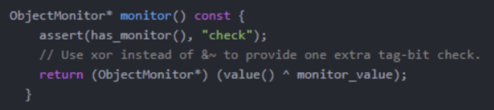
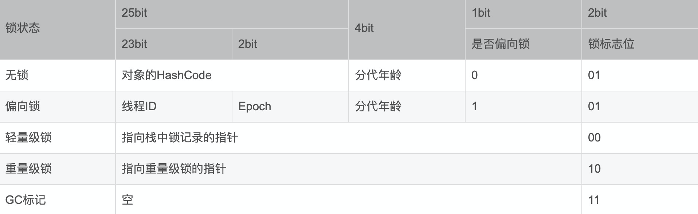
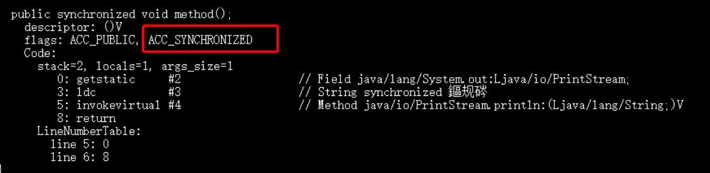

[toc]

## 1. synchronized作用

**`synchronized` 关键字解决的是多个线程之间访问资源的同步性，`synchronized`关键字可以保证被它修饰的方法或者代码块在任意时刻只能有一个线程执行。**

> 在早期Java版本中**`synchronized`**属于重量级锁。为什么？
>
> 因为监视器锁（monitor）是依赖于底层的操作系统的 `Mutex Lock` 来实现的，Java 的线程是映射到操作系统的原生线程之上的。如果要挂起或者唤醒一个线程，都需要操作系统帮忙完成，而操作系统实现线程之间的切换时需要从用户态转换到内核态，这个状态之间的转换需要相对比较长的时间，时间成本相对较高。
>
> JDK1.6 对锁的实现引入了大量的优化，如偏向锁、轻量级锁、自旋锁、适应性自旋锁、锁消除、锁粗化等技术来减少锁操作的开销。现在JDK源码和很多开源框架里面都大量使用了sychronized。

## 2. 使用方式

**synchronized 关键字最主要的三种使用方式：**

**1.修饰实例方法:** 给当前对象实例加锁，进入同步代码前要获得 **当前对象实例的锁**

```java
synchronized void method(){
  ......
}
```

**2.修饰静态方法:** 也就是给当前类加锁，进入同步代码前要获得 **当前 class 对象的锁**。因为静态成员不属于任何一个实例对象，是类成员（ _static 表明这是该类的一个静态资源，不管 new 了多少个对象，只有一份_）。所以，如果一个线程 A 调用一个实例对象的非静态 `synchronized` 方法，而线程 B 需要调用这个实例对象所属类的静态 `synchronized` 方法，是允许的，不会发生互斥现象，**因为访问静态 `synchronized` 方法占用的锁是当前类对象的锁，而访问非静态 `synchronized` 方法占用的锁是当前实例对象的锁**。

```java
synchronized void staic method() {
  ........
}
```

**3.修饰代码块:** 指定加锁对象，对给定对象/类加锁。`synchronized(this|object)` 表示进入同步代码块前要获得**给定对象的锁**。`synchronized(类.class)` 表示进入同步代码前要获得 **当前 class 对象的锁**

```java
synchronized(this) {
  ....
}

synchronized(类.class) {
  .....
}
```

## 3. synchronized实现原理

上面讲到**`synchronized`**是对 **类对象** 或者 **实例对象** 加锁，那为什么这些对象都可以实现锁呢？

1. 首先，Java 中的每个对象都派生自 Object 类，而每个Java Object 在 JVM 内部都有一个 native 的 C++对象 oop/oopDesc 进行对应。
2. 线程在获取锁的时候，实际上就是获得一个**对象监视器 (monitor)** ，**`monitor` **可以认为是一个同步对象，所有的 Java 对象是天生携带 **`monitor`**。在 hotspot 源码的 markOop.hpp 文件中，可以看到下面这段代码。



多个线程访问同步方法/代码块时，相当于去争抢对象监视器，修改**[对象头](#3.1-Java对象头)**中的**锁标识**,上面的代码中ObjectMonitor这个 对象和线程争抢锁的逻辑有密切的关系。

> `wait/notify`等方法也依赖于`monitor`对象，这就是为什么只有在同步的块或者方法中才能调用`wait/notify`等方法，否则会抛出`java.lang.IllegalMonitorStateException`的异常的原因。

### 3.1 Java对象头

在HotSpot虚拟机中, 对象在内存中的布局分为三块区域: **对象头**、**实例数据**和**对其填充**。

- **对象头：**由**MarkWord**、**Klass Point(类型指针)**和**数组长度(只有数组对象才有)**组成

  - **Klass Point：**是对象指向它的类元数据的指针，虚拟机通过这个指针来确定这个对象是哪个类的实例，该指针在32位JVM中的长度是32bit，在64位JVM中长度是64bit

  - **Mark Word：**用于存储对象自身的运行时数据，如HashCode, GC分代年龄, 锁状态标志, 线程持有的锁, 偏向线程ID等等。占用内存大小与虚拟机位长一致(32位JVM -> MarkWord是32位, 64位JVM->MarkWord是64位)

    

  - **数组长度：**只有数组对象保存了这部分数据，该数据在32位和64位JVM中长度都是32bit

  如果对象是数组对象，那么对象头占用3个字宽（Word），如果对象是非数组对象，那么对象头占用2个字宽。（1word = 2 Byte = 16 bit）

- **实例数据：**存储的是对象的属性信息，包括父类的属性信息，按照4字节对齐

- **填充字符：**因为虚拟机要求对象字节必须是8字节的整数倍，填充字符就是用于凑齐这个整数倍的

### 3.2 获取monitor对象

在JVM规范里可以看到，不管是方法同步还是代码块同步都是基于进入和退出monitor对象来实现，然而二者在具体实现上又存在很大的区别。通过javap对class字节码文件反编译可以得到反编译后的代码。

> 通过 JDK 自带的 `javap` 命令查看 `SyncDemo` 类的相关字节码信息：
>
> 首先切换到类的对应目录执行 `javac SyncDemo.java` 命令生成编译后的 .class 文件，然后执行`javap -c -s -v -l SyncDemo.class`。

#### 3.2.1 `synchronized`修饰同步代码块

```java
public class SyncDemo {
	public void method() {
		synchronized (this) {
			System.out.println("synchronized 代码块");
		}
	}
}
```


**`synchronized` 同步语句块的实现使用的是 `monitorenter` 和 `monitorexit` 指令，其中 `monitorenter` 指令指向同步代码块的开始位置，`monitorexit` 指令则指明同步代码块的结束位置。**

在执行`monitorenter`时，会尝试获取对象的锁，如果锁的计数器为 0 则表示锁可以被获取，获取后将锁计数器设为 1 也就是加 1。

在执行 `monitorexit` 指令后，将锁计数器设为 0，表明锁被释放。如果获取对象锁失败，那当前线程就要阻塞等待，直到锁被另外一个线程释放为止。

#### 3.1.2 `synchronized`修饰方法

```java
public class SyncDemo {
	public synchronized void method() {
		System.out.println("synchronized 方法");
	}
}
```



**`synchronized`** 修饰的方法并没有 **`monitorenter`** 指令和 **`monitorexit`** 指令，取得代之的确实是 **`ACC_SYNCHRONIZED`** 标识，该标识指明了该方法是一个同步方法。JVM 通过该 **`ACC_SYNCHRONIZED`** 访问标志来辨别一个方法是否声明为同步方法，从而执行相应的同步调用。

**两者的本质都是对 对象监视器 monitor 的获取。**

## 4. 锁优化

### 4.1 锁的分类

锁主要存在四种状态，级别从低到高依次是：**无锁状态**、**偏向锁状态**、**轻量级锁状态**、**重量级锁状态**，他们会**随着竞争的激烈而逐渐升级**。注意**锁可以升级不可降级**，这种策略是为了**提高获得锁和释放锁的效率**。

### 4.2 锁的升级

JDK1.6 对锁的实现引入了大量的优化，如偏向锁、轻量级锁、自旋锁、适应性自旋锁、锁消除、锁粗化等技术来减少锁操作的开销。

#### 4.2.1 偏向锁

大部分情况下，锁不仅仅不存在多线程竞争， 而是总是由同一个线程多次获得，为了让线程获取锁的代价更低就引入了偏向锁的概念。

**偏向锁加锁：**

​	