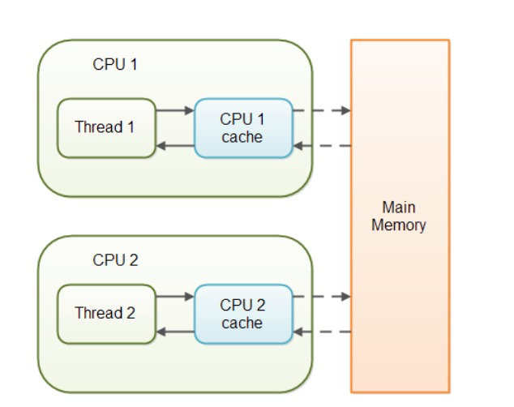

[toc]

## 1. 基本概念

**Java 内存模型(JMM)中的原子性、可见性和有序性**

- **原子性(线程切换)** : 一个的操作或者多次操作，要么所有的操作全部都得到执行并且不会收到任何因素的干扰而中断，要么所有的操作都执行，要么都不执行。[`synchronized`](synchronized关键字详解.md)关键字可以保证代码片段的原子性。
- **可见性(缓存) ：**当一个变量对共享变量进行了修改，那么另外的线程都是立即可以看到修改后的最新值。[`volatile`](volatile关键字详解.md)  关键字可以保证共享变量的可见性。
- **有序性(指令重排)** ：代码在执行的过程中的先后顺序，Java 在编译器以及运行期间的优化，代码的执行顺序未必就是编写代码时候的顺序。[`volatile`](volatile关键字详解.md) 关键字可以禁止指令进行重排序优化。

## 2. volatile

Java语言提供了一种稍弱的同步机制，即**volatile**变量，用来确保将变量的更新操作通知到其他线程。当把变量声明为volatile类型后，编译器与运行时都会注意到这个变量是共享的，因此不会将该变量上的操作与其他内存操作一起重排序。**volatile变量不会被缓存在寄存器或者对其他处理器不可见的地方，因此在读取volatile类型的变量时总会返回最新写入的值**。

**在访问volatile变量时不会执行加锁操作，因此也就不会使执行线程阻塞，因此volatile变量是一种比[`synchronized`](synchronized关键字详解.md)关键字更轻量级的同步机制。**

当对非 volatile 变量进行读写的时候，每个线程先从内存拷贝变量到CPU缓存中。如果计算机有多个CPU，每个线程可能在不同的CPU上被处理，这意味着每个线程可以拷贝到不同的 CPU cache 中。而声明变量为 volatile 后，JVM 保证了每次读变量都从内存中读，跳过 CPU cache 这一步。

> **CPU cache** 缓存的是内存数据，用于解决 CPU 处理速度和内存访问速度不匹配的问题，而内存缓存的是硬盘数据，用于解决硬盘访问速度过慢的问题

**volatile变量两种特性：**

1. **保证此变量对所有的线程的可见性**，这里的“可见性”，如本文开头所述，当一个线程修改了这个变量的值，volatile 保证了新值能立即同步到主内存，以及每次使用前立即从主内存刷新。但普通变量做不到这点，普通变量的值在线程间传递均需要通过主内存（[Java内存模型](#3-Java内存模型)）来完成。
2. **禁止指令重排序优化**。有volatile修饰的变量，赋值后多执行了一个“load addl $0x0, (%esp)”操作，这个操作相当于一个**内存屏障**（指令重排序时不能把后面的指令重排序到内存屏障之前的位置），只有一个CPU访问内存时，并不需要内存屏障；（什么是指令重排序：是指CPU采用了允许将多条指令不按程序规定的顺序分开发送给各相应电路单元处理）。

## 3. Java内存模型

### 3.1 简述

Java虚拟机规范中试图定义一种Java内存模型（Java Memory Model，JMM）来屏蔽掉各种硬件和操作系统的内存访问差异，以实现让Java程序在各种平台下都能达到一致的内存访问效果。

### 3.2 定义模型的目标

Java内存模型的主要目标是**定义程序中各个变量的访问规则，即在虚拟机中将变量存储到内存和从内存中取出变量这样的底层细节**。
	这里说的变量包括**实例字段**、**静态字段**和**构成数组对象的元素**，不包括局部变量与方法参数，因为后者是线程私有的，不会共享，也就不存在竞争的问题。

### 3.3 主内存与工作内存

Java内存模型规定了所有的变量都存储在**主内存（Main Memory）**中，此外每条线程还有自己的**工作内存（Working Memory）**。

线程的工作内存中保存了被该线程使用到的变量的主内存副本拷贝，线程对变量的所有操作（读取、赋值等）都必须在工作内存中进行，不能直接读写主内存中的变量。并且，不同的线程之间也无法直接访问对方工作内存中的变量，线程间变量值得传递均需要通过主内存来完成，线程、主内存、工作内存关系如下图：

也可以把这里的主内存与工作内存概念与JVM运行时数据区进行对应，主内存主要对应Java堆中的对象实例数据部分，工作内存对应于虚拟机栈中的部分区域。

### 3.4 内存间的交互动作

|     动作     | 作用                                                         |
| :----------: | :----------------------------------------------------------- |
|  lock(锁定)  | 作用于主内存的变量，将一个变量标示为一条线程独占的状态       |
| unlock(解锁) | 作用于主内存的变量，将一个处于锁定状态的变量释放，释放后的变量才可以被其他线程锁定 |
|  read(读取)  | 作用于主内存的变量，把一个变量的值从主内存传输到线程的工作内存中，以便随后的load动作使用 |
|  load(载入)  | 作用于工作内存的变量，把read操作从主存中得到的变量值放入工作内存的变量副本中 |
|  use(使用)   | 作用于工作内存的变量，把工作内存中一个变量的值传递给执行引擎，每当虚拟机遇到一个需要使用到变量的值的字节码指令时将会执行这个操作 |
| assign(赋值) | 作用于工作内存的变量，把一个从执行引擎接收到的值赋给工作内存中的变量，每当虚拟机遇到一个给变量赋值的字节码指令时执行这个操作 |
| store(存储)  | 作用于工作内存的变量，把工作内存中一个变量的值传送到主内存中，以便随后的write操作使用 |
| write(写入)  | 作用于主内存的变量，把store操作从工作内存中得到的变量的值放入主内存的变量中 |

