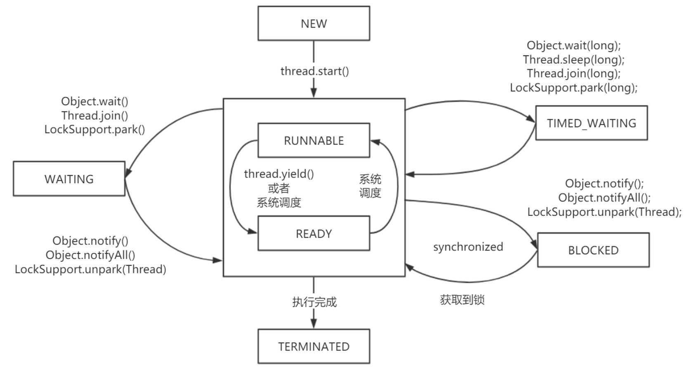
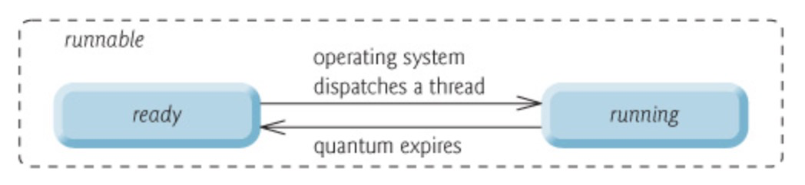

[toc]

## 1. 进程和线程

### 1.1 进程

进程是一个具有一定独立功能的程序在一个数据集上的一次动态执行的过程，是操作系统进行资源分配和调度的一个独立单位，是应用程序运行的载体。系统运行一个程序即是一个进程从创建、运行到消亡的过程。

在 Java 中，当我们启动 main 函数时其实就是启动了一个 JVM 的进程，而 main 函数所在的线程就是这个进程中的一个线程，也称主线程。

### 1.2 线程

线程是进程中负责程序执行的执行单元，依靠程序执行的顺序控制流，只能使用程序的资源和环境，共享进程的全部资源（**堆、元空间**），是CPU调度和分派的基本单位，每个线程有自己的**程序计数器、虚拟机栈、本地方法栈**。

系统产生一个线程或者在多个线程之间切换工作时，负担比进程小很多，所以线程也被称为轻量级进程。

**总结：** **线程是进程划分成的更小的执行单位。它们最大的不同在于：基本上各进程是独立的，而各线程则不一定，因为同一进程中的线程极有可能会相互影响。线程执行开销小，但不利于资源的管理和保护；而进程正相反。**

## 2. 线程

### 2.1 线程状态

|     状态     | 说明                                                         |
| :----------: | :----------------------------------------------------------- |
|     New      | 初始状态，线程被构建，但是还没有调用 start 方法              |
|   Runnable   | 运行状态，JAVA 线程把操作系统中的就绪和运行两种状态统一称为“运行中” |
|   Blocked    | 阻塞状态，表示线程进入等待状态,也就是线程因为某种原因放弃了 CPU 使用权<br/>**等待阻塞：**运行的线程执行 wait 方法，jvm 会把当前线程放入到等待队列（等待池）<br/>**同步阻塞：**运行的线程未获取到对象的同步锁时， jvm 会把当前的线程放入到锁池中<br/>**其他阻塞：**运行的线程执行 Thread.sleep 或者 t.join 方法，或者发出了 I/O 请求时，JVM 会把当前线程设置为阻塞状态，当 sleep 结束、join 线程终止、io 处理完毕则线程恢复 |
|   Waiting    | 等待状态，表示线程进度等待状态，需要等待其他线程做出一些特定动作（通知或中断） |
| TimedWaiting | 超时等待状态，等待指定时间以后自动返回                       |
|  Terminated  | 终止状态，表示当前线程执行完毕                               |

### 2.2 线程生命周期：



由上图可以看出：线程创建之后它将处于 **NEW（新建）** 状态，调用 `start()` 方法后开始运行，线程这时候处于 **READY（可运行）** 状态。可运行状态的线程获得了 CPU 时间片（timeslice）后就处于 **RUNNING（运行）** 状态。

> 操作系统隐藏 Java 虚拟机（JVM）中的 READY 和 RUNNING 状态，它只能看到 RUNNABLE 状态（图源：[HowToDoInJava](https://howtodoinjava.com/ "HowToDoInJava")：[Java Thread Life Cycle and Thread States](https://howtodoinjava.com/java/multi-threading/java-thread-life-cycle-and-thread-states/ "Java Thread Life Cycle and Thread States")），所以 Java 系统一般将这两个状态统称为 **RUNNABLE（运行中）** 状态 。
>
> 

当线程执行 `wait()`方法之后，线程进入 **WAITING（等待）** 状态。进入等待状态的线程需要依靠其他线程的通知才能够返回到运行状态，而 **TIME_WAITING(超时等待)** 状态相当于在等待状态的基础上增加了超时限制，比如通过 `sleep（long millis）`方法或 `wait（long millis）`方法可以将 Java 线程置于 TIMED WAITING 状态。当超时时间到达后 Java 线程将会返回到 RUNNABLE 状态。当线程调用同步方法时，在没有获取到锁的情况下，线程将会进入到 **BLOCKED（阻塞）** 状态。线程在执行 Runnable 的`run()`方法之后将会进入到 **TERMINATED（终止）** 状态。

### 2.3 线程的创建方式

- **继承Thread类：**

    ```java
    public class CreateThread {
    	public static void main(String[] args){
    		// 继承Thread类
    		Thread t = new CreateThreadBy();
    		t.start();
        }
    }
    /* 继承Thread类*/
    class CreateThreadBy extends Thread {
    
    	@Override
    	public void run() {
    		System.out.println(this.getName() + " 继承Thread -- 线程1");
    	}
    	
    }
    ```

- **实现Runnable接口：**

     ```java
     public class CreateThread {
     	public static void main(String[] args){
     		// 实现Runnable接口
     		Thread t = new Thread(new Runnable(){
     			@Override
     			public void run() {
     				System.out.println(Thread.currentThread().getName() +
                                        "实现 RUnable -- 线程2");
     			}
     		});
     		t.start();
         }
     }
     ```

- **实现Callable接口，通过`FutureTask`包装器来创建Thread类**

     通过`Callable` + `FutureTask`创建的线程可以有返回值

     ```java
     public class CreateThread {
     
     	public static void main(String[] args){
     		// 实现Callable的接口 ,这种方法可从线程中返回值
     		FutureTask ft = new FutureTask(new Callable(){
     			@Override
     			public Object call() throws Exception {
     				System.out.println(Thread.currentThread().getName() 
                                        + "实现Callable接口  -- 线程3");
     				return null;
     			}
     		});
     		Thread t = new Thread(ft);
     		t3.start();
         }
     }
     ```

- **线程池创建**

     后面线程池板块会讲到，推荐使用**ThreadPoolExecutor**创建

## 3. 并行和并发

- **并行：**单位时间内，多个任务同时执行
- **并发：**同一时间段，多个任务都在执行 (单位时间内不一定同时执行)

## 4. 多线程

### 4.1 并发编程的三个重要特性

- **原子性(线程切换)** : 一个的操作或者多次操作，要么所有的操作全部都得到执行并且不会收到任何因素的干扰而中断，要么所有的操作都执行，要么都不执行。[`synchronized`](synchronized关键字详解.md)关键字可以保证代码片段的原子性。
- **可见性(缓存) ：**当一个变量对共享变量进行了修改，那么另外的线程都是立即可以看到修改后的最新值。[`volatile`](volatile关键字详解.md)  关键字可以保证共享变量的可见性。
- **有序性(编译指令重排)** ：代码在执行的过程中的先后顺序，Java 在编译器以及运行期间的优化，代码的执行顺序未必就是编写代码时候的顺序。[`volatile`](volatile关键字详解.md) 关键字可以禁止指令进行重排序优化。

### 4.2 多线程的优点

总体上讲：

- **从计算机底层来说：** 线程可以比作是轻量级的进程，是程序执行的最小单位,线程间的切换和调度的成本远远小于进程。另外，多核 CPU 时代意味着多个线程可以同时运行，这减少了线程上下文切换的开销。
- **从当代互联网发展趋势来说：** 现在的系统动不动就要求百万级甚至千万级的并发量，而多线程并发编程正是开发高并发系统的基础，利用好多线程机制可以大大提高系统整体的并发能力以及性能。

计算机层面讲：

- **单核时代：** 在单核时代多线程主要是为了提高 CPU 和 IO 设备的综合利用率。举个例子：当只有一个线程的时候会导致 CPU 计算时，IO 设备空闲；进行 IO 操作时，CPU 空闲。我们可以简单地说这两者的利用率目前都是 50%左右。但是当有两个线程的时候就不一样了，当一个线程执行 CPU 计算时，另外一个线程可以进行 IO 操作，这样两个的利用率就可以在理想情况下达到 100%了。
- **多核时代:** 多核时代多线程主要是为了提高 CPU 利用率。举个例子：假如我们要计算一个复杂的任务，我们只用一个线程的话，CPU 只会一个 CPU 核心被利用到，而创建多个线程就可以让多个 CPU 核心被利用到，这样就提高了 CPU 的利用率。

### 4.3 多线程带来的问题

并发编程的目的就是为了能提高程序的执行效率提高程序运行速度，但是并发编程并不总是能提高程序运行速度的，而且并发编程可能会遇到很多问题，比如：内存泄漏、死锁、线程不安全等等。

### 4.4 线程上下文切换

多线程编程中一般线程的个数都大于 CPU 核心的个数，而一个 CPU 核心在任意时刻只能被一个线程使用，为了让这些线程都能得到有效执行，CPU 采取的策略是为每个线程分配时间片并轮转的形式。当一个线程的时间片用完的时候就会重新处于就绪状态让给其他线程使用，这个过程就属于一次上下文切换。

概括来说就是：当前任务在执行完 CPU 时间片切换到另一个任务之前会先保存自己的状态，以便下次再切换回这个任务时，可以再加载这个任务的状态。**任务从保存到再加载的过程就是一次上下文切换**。

上下文切换通常是计算密集型的。也就是说，它需要相当可观的处理器时间，在每秒几十上百次的切换中，每次切换都需要纳秒量级的时间。所以，上下文切换对系统来说意味着消耗大量的 CPU 时间，事实上，可能是操作系统中时间消耗最大的操作。

## 5. 线程死锁

### 5.1 死锁描述

死锁是指两个或两个以上的进程在执行过程中，由于竞争资源或者由于彼此通信而造成的一种阻塞的现象，若无外力作用，它们都将无法推进下去，此时称系统处于死锁状态或系统产生了死锁。

**代码示例**

```java
public class DeadLock {
    private  Object lock1 = new Object();
    private  Object lock2 = new Object();

    public static void main(String[] args) {
        new Thread(() -> {
            synchronized (lock1) {
              	System.out.println(Thread.currentThread().getName() + "获取到lock1,请求获取lock2....");
                try {
                    Thread.sleep(1000);
                } catch (InterruptedException e) {
                    e.printStackTrace();
                }
                synchronized (lock2) {
                    System.out.println("获取到lock2....");
                }
            }
        }, "线程1").start();
      
        new Thread(() -> {
            synchronized (lock2) {
              	System.out.println(Thread.currentThread().getName() + "获取到lock2,请求获取lock1....");
                try {
                    Thread.sleep(1000);
                } catch (InterruptedException e) {
                    e.printStackTrace();
                }
                synchronized (lock1) {
                    System.out.println("获取到lock1....");
                }
            }
        }, "线程2").start();
    }
}
```

**运行结果**

```
线程1获取到lock1,请求获取lock2....
线程2获取到lock2,请求获取lock1....
```

**结果分析**

线程1通过 synchronized (lock1) 获得 lock1 的监视器锁，然后通过`Thread.sleep(1000);`让线程 1休眠 1s 为的是让线程2得到执行然后获取到 lock2 的监视器锁。线程1和线程2休眠结束了都开始视图请求获取对方的资源，然后这两个线程就会陷入互相等待的状态，这也就产生了死锁。

### 5.2 死锁产生必要条件

- **互斥条件：**该资源任意一个时刻只由一个线程占用。

- **请求与保持条件：**一个进程因请求资源而阻塞时，对已获得的资源保持不放。

- **不剥夺条件**：**线程已获得的资源在末使用完之前不能被其他线程强行剥夺，只有自己使用完毕后才释放资源。

- **循环等待条件：**若干进程之间形成一种头尾相接的循环等待资源关系。

### 5.3 如何避免死锁

死锁产生必须满足上面的4个必要条件，所以我们只要破坏产生死锁的四个必要条件中的其中一个就可以了。

- **破坏互斥条件：**这个条件我们没有办法破坏，因为我们用锁本来就是想让他们互斥的（临界资源需要互斥访问）。

- **破坏请求与保持条件：**一次性申请所有的资源。

- **破坏不剥夺条件：**占用部分资源的线程进一步申请其他资源时，如果申请不到，可以主动释放它占有的资源。

- **破坏循环等待条件：**靠按序申请资源来预防。按某一顺序申请资源，释放资源则反序释放。破坏循环等待条件。

上面的例子修改成下面这样就不会产生死锁了(破坏了循环等待条件)

```java
	new Thread(() -> {
            synchronized (lock1) {
              	System.out.println(Thread.currentThread().getName() + "获取到lock1,请求获取lock2....");
                try {
                    Thread.sleep(1000);
                } catch (InterruptedException e) {
                    e.printStackTrace();
                }
                synchronized (lock2) {
                    System.out.println("获取到lock2....");
                }
            }
        }, "线程2").start();
```

## 6. sleep()和wait()的区别

两者都可以暂停线程的执行

- sleep()属于**Thread**类中的静态方法，wait()属于**Object**的成员方法
- sleep()不涉及线程通信，调用时会暂停此线程指定的时间，**不会释放对象锁**，到时间**自动恢复**；wait()用于线程间的通信，调用时会**放弃对象锁**，进入**等待队列**，待调用notify()/notifyAll()唤醒随机一个线程或者所有线程，才进入对象锁定池准备获得对象锁进入运行状态

## 7. notify()和notifyAll()的区别

- 等待池：假设一个线程A调用了某个对象的wait()方法，线程A就会释放该对象的锁后，进入到了该对象的等待池，等待池中的线程不会去竞争该对象的锁。
- 锁池：只有获取了对象的锁，线程才能执行对象的 synchronized 代码，对象的锁每次只有一个线程可以获得，其他线程只能在锁池中等待

notify() 方法**随机唤醒**对象的等待池中的一个线程，进入锁池；notifyAll() **唤醒所有**对象的等待池中的线程，进入锁池。

## 8. 线程start()和run()的区别

- start()方法用来，**开启线程**，但是线程开启后并没有立即执行，它需要获取cpu的执行权（cpu分配时间片）才可以执行
- run()方法是由jvm创建完本地操作系统级线程后**回调**的方法，不可以手动调用（否则就是普通方法）

