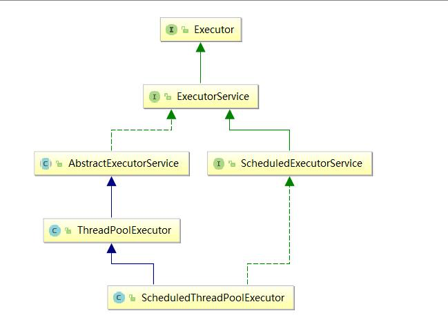
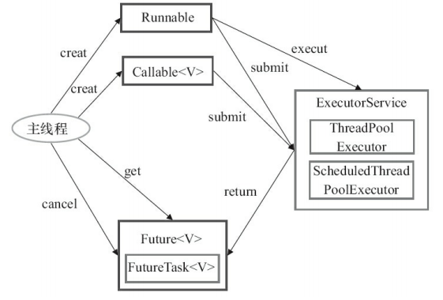

[toc]

## 一. 线程池的好处

> **池化技术相比大家已经屡见不鲜了，线程池、数据库连接池、Http 连接池等等都是对这个思想的应用。池化技术的思想主要是为了减少每次获取资源的消耗，提高对资源的利用率。**

**线程池的好处：**

- **降低资源消耗**。通过重复利用已创建的线程降低线程创建和销毁造成的消耗。
- **提高响应速度**。当任务到达时，任务可以不需要的等到线程创建就能立即执行。
- **提高线程的可管理性**。线程是稀缺资源，如果无限制的创建，不仅会消耗系统资源，还会降低系统的稳定性，使用线程池可以进行统一的分配，调优和监控。

## 二. Executor 框架

### 2.1 简介

**`Executor` **框架是 Java5 之后引进的，在 Java 5 之后，通过 Executor 来启动线程比使用 Thread 的 start 方法更好，除了更易管理，效率更好（用线程池实现，节约开销）外，还有关键的一点：有助于避免 this 逃逸问题。

> 补充：this 逃逸是指在构造函数返回之前其他线程就持有该对象的引用. 调用尚未构造完全的对象的方法可能引发令人疑惑的错误。

Executor 框架不仅包括了线程池的管理，还提供了线程工厂、队列以及拒绝策略等，Executor 框架让并发编程变得更加简单。

### 2.2 Executor 框架结构

- **任务(`Runnable` /`Callable`)**

  执行任务需要实现的 **`Runnable` 接口** 或 **`Callable`接口**。**`Runnable` 接口**或 **`Callable` 接口** 实现类都可以被 **`ThreadPoolExecutor`** 或 **`ScheduledThreadPoolExecutor`** 执行。

- **任务的执行(`Executor`)**



如上所示，包括任务执行机制的核心接口 **`Executor`** ，以及继承自 `Executor` 接口的 **`ExecutorService` 接口。`ThreadPoolExecutor`** 和 **`ScheduledThreadPoolExecutor`** 这两个关键类实现了 **ExecutorService 接口**。

**这里提了很多底层的类关系，实际上我们需要更多关注的是 `ThreadPoolExecutor` 这个类，这个类在我们实际使用线程池的过程中，使用频率还是非常高的。**

**`ThreadPoolExecutor` 类描述:**

```
//AbstractExecutorService实现了ExecutorService接口
public class ThreadPoolExecutor extends AbstractExecutorService
```

**`ScheduledThreadPoolExecutor` 类描述:**

```java
//ScheduledExecutorService继承ExecutorService接口
public class ScheduledThreadPoolExecutor
        			extends ThreadPoolExecutor
        			implements ScheduledExecutorService
```

- **异步计算的结果(`Future`)**

  **`Future`** 接口以及 `Future` 接口的实现类 **`FutureTask`** 类都可以代表异步计算的结果。

  当我们把 **`Runnable`接口** 或 **`Callable` 接口** 的实现类提交给 **`ThreadPoolExecutor`** 或 **`ScheduledThreadPoolExecutor`** 执行。（调用 `submit()` 方法时会返回一个 **`FutureTask`** 对象）

### 2.3 Executor 框架使用示意图



1. **主线程首先要创建实现 `Runnable` 或者 `Callable` 接口的任务对象。**
2. **把创建完成的实现 `Runnable`/`Callable`接口的 对象直接交给 `ExecutorService` 执行**: `ExecutorService.execute（Runnable command）`）或者也可以把 `Runnable` 对象或`Callable` 对象提交给 `ExecutorService` 执行（`ExecutorService.submit（Runnable task）`或 `ExecutorService.submit（Callable <T> task）`）。
3. **如果执行 `ExecutorService.submit（…）`，`ExecutorService` 将返回一个实现`Future`接口的对象**（我们刚刚也提到过了执行 `execute()`方法和 `submit()`方法的区别，`submit()`会返回一个 `FutureTask 对象）。由于 FutureTask` 实现了 `Runnable`，我们也可以创建 `FutureTask`，然后直接交给 `ExecutorService` 执行。
4. **最后，主线程可以执行 `FutureTask.get()`方法来等待任务执行完成。主线程也可以执行 `FutureTask.cancel（boolean mayInterruptIfRunning）`来取消此任务的执行。**

## 三. ThreadPoolExecutor 类

**线程池实现类 `ThreadPoolExecutor` 是 `Executor` 框架最核心的类。**

`ThreadPoolExecutor` 类中提供了四个构造方法，我们看一下最长的这个：

```java
public ThreadPoolExecutor(int corePoolSize,//线程池的核心线程数量
                          int maximumPoolSize,//线程池的最大线程数
                          long keepAliveTime,//当线程数大于核心线程数时，多余的空闲线程存活的最长时间
                          TimeUnit unit,//时间单位
                          BlockingQueue<Runnable> workQueue,//任务队列，用来储存等待执行任务的队列
                          ThreadFactory threadFactory,//线程工厂，用来创建线程，一般默认即可
                          RejectedExecutionHandler handler//拒绝策略，当提交的任务过多而不能及时处理时，我们可以定制策略来处理任务
                         ) {
        if (corePoolSize < 0 ||
            maximumPoolSize <= 0 ||
            maximumPoolSize < corePoolSize ||
            keepAliveTime < 0)
            throw new IllegalArgumentException();
        if (workQueue == null || threadFactory == null || handler == null)
            throw new NullPointerException();
        this.acc = System.getSecurityManager() == null ?
                null :
                AccessController.getContext();
        this.corePoolSize = corePoolSize;
        this.maximumPoolSize = maximumPoolSize;
        this.workQueue = workQueue;
        this.keepAliveTime = unit.toNanos(keepAliveTime);
        this.threadFactory = threadFactory;
        this.handler = handler;
}
```

**`ThreadPoolExecutor` 3 个最重要的参数：**

- **`corePoolSize` :** 核心线程数线程数定义了最小可以同时运行的线程数量。
- **`maximumPoolSize` :** 当队列中存放的任务达到队列容量的时候，当前可以同时运行的线程数量变为最大线程数。
- **`workQueue`:** 当新任务来的时候会先判断当前运行的线程数量是否达到核心线程数，如果达到的话，新任务就会被存放在队列中。

`ThreadPoolExecutor`其他常见参数:

- **`keepAliveTime`**:当线程池中的线程数量大于 `corePoolSize` 的时候，如果这时没有新的任务提交，核心线程外的线程不会立即销毁，而是会等待，直到等待的时间超过了 `keepAliveTime`才会被回收销毁；
- **`unit`** : `keepAliveTime` 参数的时间单位。
- **`threadFactory`** :executor 创建新线程的时候会用到。
- **`handler`** :饱和策略。

**`ThreadPoolExecutor` 饱和策略定义:**

如果当前同时运行的线程数量达到最大线程数量并且队列也已经被放满了任务时，`ThreadPoolTaskExecutor` 定义一些策略:

- **`ThreadPoolExecutor.AbortPolicy（默认）`**：抛出 `RejectedExecutionException`来拒绝新任务的处理。
- **`ThreadPoolExecutor.CallerRunsPolicy`**：调用执行自己的线程运行任务，也就是直接在调用`execute`方法的线程中运行(`run`)被拒绝的任务，如果执行程序已关闭，则会丢弃该任务。因此这种策略会降低对于新任务提交速度，影响程序的整体性能。如果您的应用程序可以承受此延迟并且你要求任何一个任务请求都要被执行的话，你可以选择这个策略。
- **`ThreadPoolExecutor.DiscardPolicy`：** 不处理新任务，直接丢弃掉。
- **`ThreadPoolExecutor.DiscardOldestPolicy`：** 此策略将丢弃最早的未处理的任务请求。

## 四. 常见的线程池介绍

Executors 返回线程池对象的弊端如下：

- **`FixedThreadPool` 和 `SingleThreadExecutor`** ：使用无界队列**`LinkedBlockingQueue`** 作为线程池的工作队列（队列的容量为 Intger.MAX_VALUE）,可能堆积大量的请求，从而导致 OOM。
- **`CachedThreadPool` 和 `ScheduledThreadPool`** ： 允许创建的线程数量为 Integer.MAX_VALUE ，可能会创建大量线程，从而导致 OOM。

线程池介绍：

- **`ThreadPoolExecutor`**，推荐使用此类的构造函数创建线程池，而不是使用 **`Executors`** 去创建（会导致OOM）

- **`SingleThreadExecutor`：**单个线程的线程池

  ```java
  public static ExecutorService newSingleThreadExecutor() {
          return new FinalizableDelegatedExecutorService
              (new ThreadPoolExecutor(1, 1,
                                      0L, TimeUnit.MILLISECONDS,
                                      new LinkedBlockingQueue<Runnable>()));
  }
  ```

- **`FixThreadPool`:**固定线程数的线程池

  ```java
  public static ExecutorService newFixedThreadPool(int nThreads) {
          return new ThreadPoolExecutor(nThreads, nThreads,
                                        0L, TimeUnit.MILLISECONDS,
                                        new LinkedBlockingQueue<Runnable>());
  }
  ```

- **`CachedThreadPool`：**根据需要创建新线程的线程池

  ```java
  public static ExecutorService newCachedThreadPool() {
          return new ThreadPoolExecutor(0, Integer.MAX_VALUE,
                                        60L, TimeUnit.SECONDS,
                                        new SynchronousQueue<Runnable>());
  }
  ```

- **`ScheduledThreadPool`：**有固定线程数量的定时线程任务的线程池

  ```java
  public ScheduledThreadPoolExecutor(int corePoolSize) {
          super(corePoolSize, Integer.MAX_VALUE, 0, NANOSECONDS,
                new DelayedWorkQueue());
  }
  ```

## 五. 线程池原理

在使用线程池时，我们会调用**`execute()`**方法将任务添加到线程池中，那下面我们来看看该方法是怎么实现的

```java
//存放线程池的运行状态 (runState) 和线程池内有效线程的数量 (workerCount)
private final AtomicInteger ctl = new AtomicInteger(ctlOf(RUNNING, 0));

private static int workerCountOf(int c) {
        return c & CAPACITY;
}
//任务队列
private final BlockingQueue<Runnable> workQueue;

public void execute(Runnable command) {
  	// 如果任务为null，则抛出异常
    if (command == null)
        throw new NullPointerException();
    // ctl 中保存的线程池当前的一些状态信息
    int c = ctl.get();
  	// 1、工作线程小于核心线程数 corePoolSize，创建新的线程
    if (workerCountOf(c) < corePoolSize) {
      	// 创建新的worker立即执行command，并且轮训workQueue处理task
        if (addWorker(command, true))
            return;
        c = ctl.get();
    }
  	// 2、工作线程大于核心线程数
  	// 线程池在运行状态且可以将task插入队列
  	// 第一次校验线程池在运行状态
    if (isRunning(c) && workQueue.offer(command)) {
        int recheck = ctl.get();
      	// 第二次校验，防止在第一次校验通过后线程池关闭。如果线程池关闭，在队列中删除task并拒绝task
        if (! isRunning(recheck) && remove(command))
            reject(command);
      	// 如果线程数=0（线程都死掉了，比如：corePoolSize=0），新建线程且未指定firstTask，仅仅去轮训workQueue
        else if (workerCountOf(recheck) == 0)
            addWorker(null, false);
    }
  	// 3、线程队列已满，尝试创建新线程执行task，创建失败后拒绝task
    // 创建失败原因：1.线程池关闭；2.线程数已经达到maxPoolSize
    else if (!addWorker(command, false))
        reject(command);
}
```

execute方法执行流程：

.png)

**addWorker(Runnable firstTask, boolean core),创建新的线程**

firstTask: worker线程的初始任务，可以为空
 	   core: true：将corePoolSize作为上限，false：将maximumPoolSize作为上限

```java
private boolean addWorker(Runnable firstTask, boolean core) {
        retry:
　　　　 //外层循环判断线程池的状态
        for (;;) {
            int c = ctl.get();
            int rs = runStateOf(c);//线程池状态
　　　　　
            // Check if queue empty only if necessary.
　　　　　　　//线程池状态:RUNNING = -1、SHUTDOWN = 0、STOP = 1、TIDYING = 2、TERMINATED = 3　
            
　　　　　　　　//线程池至少是shutdown状态
　　　　　　　 if (rs >= SHUTDOWN &&
　　　　　　　　　　//除了线程池正在关闭（shutdown），队列里还有未处理的task的情况，其他都不能添加
                ! (rs == SHUTDOWN &&
                   firstTask == null &&
                   ! workQueue.isEmpty()))
                return false;
            //内层循环判断是否到达容量上限，worker+1
            for (;;) {
                int wc = workerCountOf(c);//worker数量
                //// core参数为true的话表明队列也满了，线程池大小变为 maximumPoolSize
                if (wc >= CAPACITY ||
                    wc >= (core ? corePoolSize : maximumPoolSize))
                    return false;
                //CAS worker+1
                if (compareAndIncrementWorkerCount(c))
                    break retry;//成功了跳出循环
                c = ctl.get();  // Re-read ctl
                if (runStateOf(c) != rs) //如果线程池状态发生变化，重试外层循环
                    continue retry;
                // else CAS failed due to workerCount change; retry inner loop 
　　　　　　　　　// CAS失败workerCount被其他线程改变，重新尝试内层循环CAS对workerCount+1

            }
        }
				// 标记工作线程是否启动成功
        boolean workerStarted = false;
  			// 标记工作线程是否创建成功
        boolean workerAdded = false;
        Worker w = null;
        try {
            final ReentrantLock mainLock = this.mainLock;
          	// 创建线程
            w = new Worker(firstTask); //1.state置为-1，Worker继承了AbstractQueuedSynchronizer
                                       //2.设置firstTask属性
                                       //3.Worker实现了Runable接口，将this作为入参创建线程
            final Thread t = w.thread;
            if (t != null) {
　　　　　　　　　　//addWorker需要加锁
                mainLock.lock();
                try {
                    // Recheck while holding lock.
                    // Back out on ThreadFactory failure or if
                    // shut down before lock acquired.
                    int c = ctl.get();
                    int rs = runStateOf(c);
										//rs < SHUTDOWN 如果线程池状态依然为RUNNING,并且线程的状态是存活的话，就会将工作线程添加到工作线程集											合中
                  //(rs=SHUTDOWN && firstTask == null)如果线程池状态小于STOP，也就是RUNNING或者SHUTDOWN状态下，同时										传入的任务实例firstTask为null，则需要添加到工作线程集合和启动新的Worker
                   // firstTask == null证明只新建线程而不执行任务
                    if (rs < SHUTDOWN ||
                        (rs == SHUTDOWN && firstTask == null)) {
                        if (t.isAlive()) // precheck that t is startable
                            throw new IllegalThreadStateException();
                      	// workers是HashSet<Worker>，线程池this的worker容器，保持对thread的引用
                        workers.add(w);
　　　　　　　　　　　　　　//更新当前工作线程的最大容量
                        int s = workers.size();
                        if (s > largestPoolSize)
                            largestPoolSize = s;
                        workerAdded = true;
                    }
                } finally {
                    mainLock.unlock();
                }
              	// 添加完成后启动线程
                if (workerAdded) {
                    t.start();
                  	// 标记线程启动成功
                    workerStarted = true;
                }
            }
        } finally {
          	// 线程启动失败，需要从工作线程中移除对应的Worker
            if (! workerStarted)
                addWorkerFailed(w);
        }
        return workerStarted;
    }
```

**new Worker(firstTask)**

```java
// 继承了AQS，实现了Runnable接口
private final class Worker extends AbstractQueuedSynchronizer implements Runnable
    {
        /**
         * This class will never be serialized, but we provide a
         * serialVersionUID to suppress a javac warning.
         */
        private static final long serialVersionUID = 6138294804551838833L;

        /** Thread this worker is running in.  Null if factory fails. */
        final Thread thread;
        /** Initial task to run.  Possibly null. */
        Runnable firstTask;
        /** Per-thread task counter */
        volatile long completedTasks;

        /**
         * Creates with given first task and thread from ThreadFactory.
         * @param firstTask the first task (null if none)
         */
  			// 构造方法中创建线程，并制定runnable tast 为this
        Worker(Runnable firstTask) {
            setState(-1); // inhibit interrupts until runWorker
            this.firstTask = firstTask;
            this.thread = getThreadFactory().newThread(this);
        }

        /** Delegates main run loop to outer runWorker  */
  			// start()后调用此任务的run（）方法
        public void run() {
            runWorker(this);
        }
```

**runWorker(this)**

```java
final void runWorker(Worker w) {
        Thread wt = Thread.currentThread();
        Runnable task = w.firstTask;
        w.firstTask = null;
        w.unlock(); // allow interrupts
        boolean completedAbruptly = true;
        try {
          	//while循环获取任务
          	// getTask()从队列中取任务，当前线程只能在当前task执行完后才能接下一个
            while (task != null || (task = getTask()) != null) {
                w.lock();
                // If pool is stopping, ensure thread is interrupted;
                // if not, ensure thread is not interrupted.  This
                // requires a recheck in second case to deal with
                // shutdownNow race while clearing interrupt
              	//如果线程池是stop状态，确保线程被中断，如果线程池不是，确保线程池没有被中断。
                //当我们清空中断标志时，第二种情况需要需要有一个recheck来应对shutdownNow方法
                if ((runStateAtLeast(ctl.get(), STOP) ||
                     (Thread.interrupted() &&
                      runStateAtLeast(ctl.get(), STOP))) &&
                    !wt.isInterrupted())
                    wt.interrupt();
                try {
                    beforeExecute(wt, task);
                    Throwable thrown = null;
                    try {
                      	// 执行任务
                        task.run();
                    } catch (RuntimeException x) {
                        thrown = x; throw x;
                    } catch (Error x) {
                        thrown = x; throw x;
                    } catch (Throwable x) {
                        thrown = x; throw new Error(x);
                    } finally {
                      	// 自定义ThreadLocal清理
                        afterExecute(task, thrown);
                    }
                } finally {
                    task = null;
                    w.completedTasks++;
                    w.unlock();
                }
            }
          	// 任务全部执行完后
            completedAbruptly = false;
        } finally {
          	// 抛异常时是否删除core任务线程
            processWorkerExit(w, completedAbruptly);
        }
    }
```

**processWorkerExit(Worker w, boolean completedAbruptly)**

```java
private void processWorkerExit(Worker w, boolean completedAbruptly) {
  			// cas 工作线程数减1（线程终端导致的退出，才会让workerCount -1）
        if (completedAbruptly) // If abrupt, then workerCount wasn't adjusted
            decrementWorkerCount();

        final ReentrantLock mainLock = this.mainLock;
        mainLock.lock();
        try {
            completedTaskCount += w.completedTasks;
            // 删除线程
            workers.remove(w);
        } finally {
            mainLock.unlock();
        }

        tryTerminate();

        int c = ctl.get();
        if (runStateLessThan(c, STOP)) {
            if (!completedAbruptly) {
                int min = allowCoreThreadTimeOut ? 0 : corePoolSize;
                if (min == 0 && ! workQueue.isEmpty())
                    min = 1;
                if (workerCountOf(c) >= min)
                    return; // replacement not needed
            }
          	// 终端导致线程退出后再创建一个新的线程
            addWorker(null, false);
        }
    }
```

## 六. 线程池大小

在实际开发中，很多人对线程池的大小设置都是随心而定，没有一个具体的量化标准。

**如果设置太大，大量线程可能会同时在争取 CPU 资源，这样会导致大量的上下文切换，从而增加线程的执行时间，影响了整体执行效率。**

**如果设置太小，当同一时间有大量任务需要处理，可能会导致大量的请求/任务在任务队列中排队等待执行，甚至会出现任务队列满了之后任务无法处理的情况，或者大量任务堆积在任务队列导致 OOM，CPU 根本没有得到充分利用**

那到底应该怎么设置线程池的大小呢？这个就要看多线程的具体应用场景了。我们的程序一般都是CPU计算和I/O操作交叉执行的，由于I/O设备的速度相对于CPU来说都很慢，随意大部分情况下，I/O操作执行的时间相对于CPU计算来说都非常长，这种场景我们一般都称为I/O密集型计算；和I/O密集型计算相对应的就是CPU密集型计算了，CPU密集型计算大部分场景下都是纯CPU计算。I/O密集型程序和CPU密集型程序计算最佳线程数的方法是不同。

- **CPU密集型：最佳线程数 = CPU核数 + 1**

  这种任务消耗的主要是 CPU 资源，可以将线程数设置为 N（CPU 核心数）+1，比 CPU 核心数多出来的一个线程是为了防止线程偶发的缺页中断，或者其它原因导致的任务暂停而带来的影响。一旦任务暂停，CPU 就会处于空闲状态，而在这种情况下多出来的一个线程就可以充分利用 CPU 的空闲时间。

- **I/O密集型：最佳线程数 = CPU核数 * [1 + (I/O耗时  / CPU耗时)]**

  这种任务应用起来，系统会用大部分的时间来处理 I/O 交互，而线程在处理 I/O 的时间段内不会占用 CPU 来处理，这时就可以将 CPU 交出给其它线程使用。因此在 I/O 密集型任务的应用中，我们可以多配置一些线程。

## 七. 线程池常见方法比较

### 7.1 `Runnable` 和 `Callable`

- **`Runnable`：**不会返回结果或抛出检查异常`
- **`Callable`:**  有返回结果，可以抛出异常

### 7.2  `execute()` vs `submit()`

- **`execute()`方法用于提交不需要返回值的任务，所以无法判断任务是否被线程池执行成功与否**
- **`submit()`方法用于提交需要返回值的任务。线程池会返回一个 `Future` 类型的对象，通过这个 `Future` 对象可以判断任务是否执行成功，并且可以通过 `Future` 的 `get()`方法来获取返回值，**`get()`方法会阻塞当前线程直到任务完成，而使用 `get（long timeout，TimeUnit unit）`方法则会阻塞当前线程一段时间后立即返回，这时候有可能任务没有执行完。

### 7.3 `shutdown()`VS`shutdownNow()`

- **`shutdown()`：** 关闭线程池，线程池的状态变为 `SHUTDOWN`。线程池不再接受新任务了，但是队列里的任务得执行完毕。
- **`shutdownNow()`：** :关闭线程池，线程的状态变为 `STOP`。线程池会终止当前正在运行的任务，并停止处理排队的任务并返回正在等待执行的 List。

### 7.4 `isTerminated()` VS `isShutdown()`

- **`isShutDown`** 当调用 `shutdown()` 方法后返回为 true。
- **`isTerminated`** 当调用 `shutdown()` 方法后，并且所有提交的任务完成后返回为 true